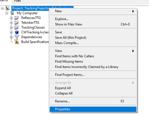

# ATS Deployment

| Code          | Editor       |
| ------------- | ------------ |
| 3151_MCS_0051 | Julen Garcia |

## Introduction

This document describes the procedure to setup the different systems for running the automatic test system.

## Software Deployment

Each hardware has different software parts, and some hardware had more than one software part. In the following sections
each hardware element is explained.

### Windows Machine

In the Windows Machine some simulators and some tools are running. Start installing the Force EtherCAT Variables
installer, this will install the LabVIEW runtime needed in many other tools and simulators.

#### Force EtherCAT Variables

This tool allows writing data to EtherCAT variables to other simulators using a TCP based custom protocol. The value
written using this tool will overwrite any set value, so any slave value will be overwritten with the written value. The
source code and more documentation about configuration can be found in
[this repo](https://github.com/lsst-ts/ts_tma_hil_force-ethercat-vars)

Follow next steps to deploy this software:

1. If the installer is available continue to step 6
2. Clone the repository in the link above
3. Open the project `ForceEtherCATVars.lvproj`
4. Go to *Build Specifications* and right click in *ForceIOs* to select *Build*
5. Go to *Build Specifications* and right click in *ForceEtherCatVars Installer* to select *Build*
6. When compilation is finished, open location and copy the `Volume` folder to Windows Machine
7. Install the tool using the *install.exe*
8. Run *ForceIOs.exe*.

#### Read/Write Network Shared Variables Tool

This tool allows reading and writing data from network shared variables to other simulators and back using a TCP based
custom protocol. The source code and more documentation about configuration can be found in
[this repo](https://github.com/lsst-ts/ts_tma_hil_read-variables)

Follow next steps to deploy this software:

1. If the installer or executable is available continue to step 6
2. Clone the repository in the link above
3. Open the project `ReadVariables.lvproj`
4. Go to *Build Specifications* and right click in *Executable* to select *Build*
5. When build finishes go to build folder and copy all files and folder
6. Paste compilation files to desired destination in Windows Machine
7. Open the `data` folder and open "WriteReadVarConfig.xml".
8. Change the path of the field *TCP_configuration_file* to point to *TCP_ServerConfig.xml* file in the same data folder.
9. Run *ReadWriteNSVs.exe*

This tool is used for reading the variables from 3 different hosts the configuration for each of the instances can be
found [here](https://github.com/lsst-ts/ts_tma_hil_read-variables/tree/develop/Configuration):

- ReadWriteAxesPXI_NSVs: the configuration for the instance that reads/writes the variables from the AxesPXI.
- ReadWriteTMAPXI_NSVs: the configuration for the instance that reads/writes the variables from the TMA_PXI.
- ReadWriteLocal_NSVs: the configuration for the instance that reads/writes the variables from the WindowMachine.

#### BoschPowerSupplySimulator

This is a simulator for the bosch power supply, this simulator manages the digital inputs that tell the TMA PXI the
status of the power supply. The source code and more documentation about configuration can be found in
[this repo](https://github.com/lsst-ts/ts_tma_hil_bosch-power-supply_bosch-power-supply-simulator)

Follow next steps to deploy this software:

1. If the installer or executable is available continue to step 6
2. Clone the repository in the link above
3. Open the project `BoschPowerSupplySimulator.lvproj`
4. Go to *Build Specifications* and right click in *Executable* to select *Build*
5. When build finishes go to build folder and copy all files and folder
6. Paste compilation files to desired destination in Windows Machine
7. Run *BoschPowerSupplySimulator.exe*

#### motorThermalModelSimulator

This is a simulator for the thermal behavior of the phase motors, this simulator manages the analog inputs that tell
the TMA PXI the temperatures of the motors and uses this values to control the output signal of the valve to manage the
temperature of them. The source code and more documentation about configuration can be found in
[this repo](https://github.com/lsst-ts/ts_tma_hil_motor-thermal-model_motor-thermal-model-simulator)

Follow next steps to deploy this software:

1. If the installer or executable is available continue to step 6
2. Clone the repository in the link above
3. Open the project `motorThermalModelSimulator.lvproj`
4. Go to *Build Specifications* and right click in *Executable* to select *Build*
5. When build finishes go to build folder and copy all files and folder
6. Paste compilation files to desired destination in Windows Machine
7. Run *motorThermalModelSimulator.exe*

#### PhasePowerSupplySimulator

This is a simulator for the phase power supply, this simulator manages the analog inputs that tell the TMA PXI the
status of the power supply. The source code and more documentation about configuration can be found in
[this repo](https://github.com/lsst-ts/ts_tma_hil_phase-power-supply_phase-power-supply-simulator)

Follow next steps to deploy this software:

1. If the installer or executable is available continue to step 6
2. Clone the repository in the link above
3. Open the project `PhasePowerSupplySimulator.lvproj`
4. Go to *Build Specifications* and right click in *Executable* to select *Build*
5. When build finishes go to build folder and copy all files and folder
6. Paste compilation files to desired destination in Windows Machine
7. Run *PhasePowerSupplySimulator.exe*

#### Simulate limits

This software allows to simulate the behavior of some subsystem limits switches. Those limits could be part of safety
system or EtherCAT distributed IOs. The source code and more documentation about configuration can be found in
[this repo](https://github.com/lsst-ts/ts_tma_hil_simulate-limits)

Follow next steps to deploy this software:

1. If the installer or executable is available continue to step 6
2. Clone the repository in the link above
3. Open the project `SimulateLimits.lvproj`
4. Go to *Build Specifications* and right click in "SimulateLimits" to select *Build*
5. When build finishes go to build folder and copy all files and folders
6. Paste compiled files to desired destination in the Windows Machine
7. Open the `data` folder and open `GeneralConfiguration.xml`
8. Change the first path of the field *TCP_senders_configuration_Path* to point to *ForceECATVars_TCP_SenderConfig.xml*
  file in the same data folder.
9. Change `dim='[X]'` to `dim='[1]'` for *TCP_senders_configuration_Path* and for *LimitsDefinition* tags. We are only
  using the first configured limit because you need the safety full simulator with PILZ hardware to use other limits,
  When you get this hardware (perhaps you have one on the summit) we can download code to it and use those other limits.
10. Run *SimulateLimits.exe*

> TODO: Steps 8 and 9 are not 100% clear, need to check

#### cabinetTemperatureControllerSimulator

This is a simulator for the temperature controller of the cabinets, this simulator contains the simulator of the
different temperature controllers available all over the telescope. The source code and more documentation about
configuration can be found in
[this repo](https://github.com/lsst-ts/ts_tma_hil_cabinet-temperature-controller_cabinets)

Follow next steps to deploy this software:

1. If the installer or executable is available continue to step 6
2. Clone the repository in the link above
3. Open the project `cabinetTemperatureControllerSimulator.lvproj`
4. Go to *Build Specifications* and right click in *Executable* to select *Build*
5. When build finishes go to build folder and copy all files and folder
6. Paste compilation files to desired destination in Windows Machine
7. Run *cabinetTemperatureControllerSimulator.exe*

The cabinets included in this simulator are:

- *TMA_AX_DZ_CBT_0001* (Phase Main Power Cabinet)
- *TMA_AZ_CS_CBT_0001* (TEK Mount Control System cabinet - MCS)
- *TMA_AZ_PD_CBT_0001* (Azimuth Power Distribution)
- *TMA_AZ_PD_TRM_0001* (Isolation transformer)
- *TMA_EL_PD_CBT_0001* (Elevation Power Distribution 1)
- *TMA_EL_PD_CBT_0002* (Elevation Power Distribution 2)

#### extensionSimulatorForDP

This is a simulator for the extensions of the deployable platforms, this simulator manages the digital inputs that tell
the Safety system the status of the extensions of the deployable platforms. The source code and more documentation about
configuration can be found in
[this repo](https://github.com/lsst-ts/ts_tma_hil_deployable-platform-extensions-simulator)

Follow next steps to deploy this software:

1. If the installer or executable is available continue to step 6
2. Clone the repository in the link above
3. Open the project `DPextensionsSimulator.lvproj`
4. Go to *Build Specifications* and right click in *Executable* to select *Build*
5. When build finishes go to build folder and copy all files and folder
6. Paste compilation files to desired destination in Windows Machine
7. Run *extensionSimulatorForDP.exe*

#### OilSupplySystemSimulator

This is a simulator for the Oil Supply System (OSS), this simulator contains a modbus server that connects to the AUX
PXI to transmit the status of the OSS. The source code and more documentation about configuration can be found in
[this repo](https://github.com/lsst-ts/ts_tma_hil_oil-supply-system_oil-supply-system-simulator)

Follow next steps to deploy this software:

1. If the installer or executable is available continue to step 6
2. Clone the repository in the link above
3. Open the project `OilSupplySystemSimulator.lvproj`
4. Go to *Build Specifications* and right click in *Executable* to select *Build*
5. When build finishes go to build folder and copy all files and folder
6. Paste compilation files to desired destination in Windows Machine
7. Run *OilSupplySystemSimulator.exe*

#### SpeedgoatManager

This is a simulator tool used for the robot framework tests to connect to the Speedgoat. The source code and more
documentation can be found in [this repo](https://github.com/lsst-ts/ts_tma_hil_speedgoat_speedgoat-manager).

Follow next steps to deploy this software:

1. Get the latest version of the compiled code from
   [built app repo](https://github.com/lsst-ts/ts_tma_hil_speedgoat_speedgoat-manager-binaries) in a folder called
   `SpeedgoatManager`
2. Get the latest version of the compiled models for the speedgoat and clone the repo in a folder named
   `slrtbinariesforspeedgoat` next to the `SpeedgoatManager` folder. The result should look like the image below:

   

#### Top End Chiller simulator

This is a simulator for the Top End Chiller (TEC), this simulator contains a modbus server that connects to the AUX
PXI to transmit the status of the TEC. The source code and more documentation about configuration can be found in
[this repo](https://github.com/lsst-ts/ts_tma_hil_simulator_top-end-chiller/)

Follow the steps defined in the repo [README](https://github.com/lsst-ts/ts_tma_hil_simulator_top-end-chiller/blob/develop/README.md)

### Linux Machine

In the Linux Machine the secondary axis simulators and the robot framework tests are running.

#### secondaryAxisSil

This is a simulator for the secondary axes (bosch axes), this simulator contains a modbus server that connects to the
TMA PXI to transmit the status of each of the axes. The source code and more documentation about configuration can be
found in [this repo](https://github.com/lsst-ts/ts_tma_hil_secondary-axis_secondaryaxissil)

Follow the steps defined in the repo [README](https://github.com/lsst-ts/ts_tma_hil_secondary-axis_secondaryaxissil/blob/master/README.md)

#### robotFramework

This refers to the automatic test framework the installation steps to setup the environment for robot framework is
explained [here](https://github.com/lsst-ts/ts_tma_test_automatic-test-code/blob/develop/docs/Installation.md)

The source code and more documentation can be found in
[this repo](https://github.com/lsst-ts/ts_tma_test_automatic-test-code/)

### TMA PXI

This is the PXI where the control code for all subsystems is running. To be able to configure the TMA PXI, the
development PC should be configured as shown in the
[deployment document](https://ts-tma.lsst.io/docs/tma_maintenance_deployment/deployment.html#development-pc)

1. Download the [PXI repository](https://github.com/lsst-ts/ts_tma_labview_pxi-controller)
2. Open the `ATS_Projects/ATS_LSST_MainControllerPXI.lvproj`
3. Ensure that in the project properties the *Conditional Disable Symbol* `HIL` is set to `True`

    1. Right click in the project an select properties

    

    2. In the opened window go to *Conditional Disable Symbols* page and set the value for `HIL` symbol to `True`.

    

4. Open the main `RT_MCS_Main.vi`
   1. Solve the requested dependencies if they appear.
   2. Close the main.
   3. Save all the request files.
5. Build the `rtexe`
   1. Open the *Build Specifications* section
   2. Right click and build

    

6. Once built, deploy the rtexe to the target. This can be done using SSH (scp) or with the LabVIEW project.
7. Before rebooting the PXI, deploy the Network Shared Variables (NSVs) for the ATS.
   1. Open the `ATS_Projects/ATS_TMA_PXI.lvproj`
   2. Connect the project to the PXI
   3. Deploy the `ATS_ECATSlave_NSV.lvlib`. This lib contains the NSVs for the ATS simulation mode.

    

   4. Disconnect from the project
8. Reboot the PXI -> check the boot of the PXI with the *labviewmessages* alias command

  > To test just one subsystem some specific test VIs can be found inside the corresponding subsystem folder. For
  > example the Balancing specific test VI shown bellow:
  > 
  > These are not built, but could be run and deployed from the project directly if needed

### Axes PXI

Same as TMA-PXI, but instead of opening the TMA project, open the `ATS_Projects/ATS_MainAxes.lvproj` and the
`MAIN_AxesPXI.vi`. And instead of deploying the NSVs library, deploy the ethercat master, see image below.

### AUX PXI

Same as TMA-PXI, but instead of opening the TMA project, open the `ATS_Projects/ATS_AuxSystemsController.lvproj` and the
`AuxSystemsMain.vi`. For this PXI there are no libraries to be deployed

### Safety code deployment

The code that runs on the PILZ controller to simulate the behavior of the TMA IS. The source code and more
documentation about configuration can be found in
[this repo](https://github.com/lsst-ts/ts_tma_hil_test-dual-modbus)

1. Open the *TestDualModbus* project with *PAS4000* version 1.18.0
2. Activate the *TestDualModbus*

  

3. Open the online network editor.

  

4. Scan project to scan the network to verify that the PILZ CPU is connected.

  

5. Close the online network editor
6. Download the project
    1. Open the Project downloader:

    

    > If asked to build changes say YES
    > 

    2. Start download:

    

    3. Confirm download:

    

    4. Download completed:

    

7. Logout:

  

8. Close the PAS4000
