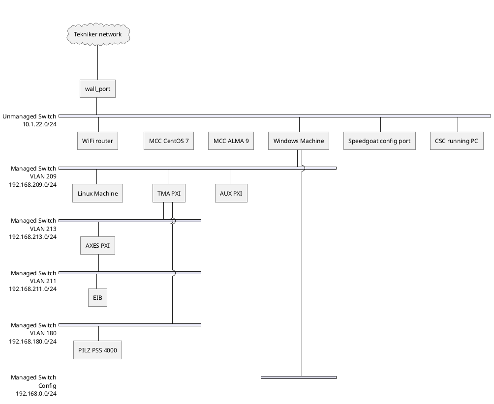
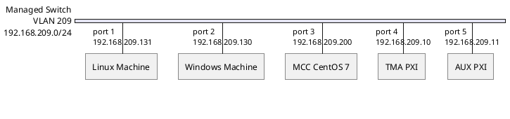
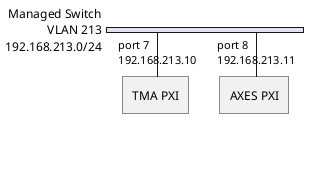
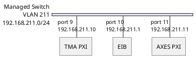
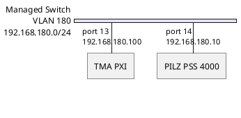
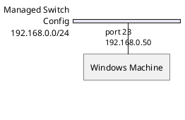
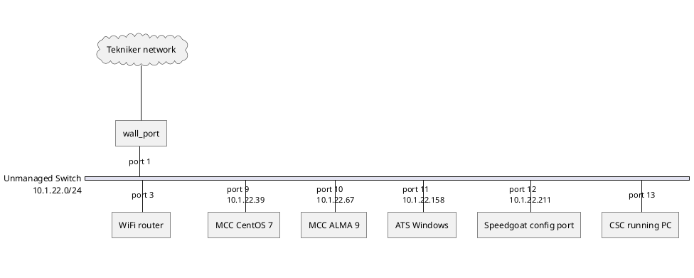
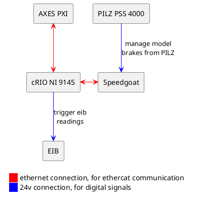
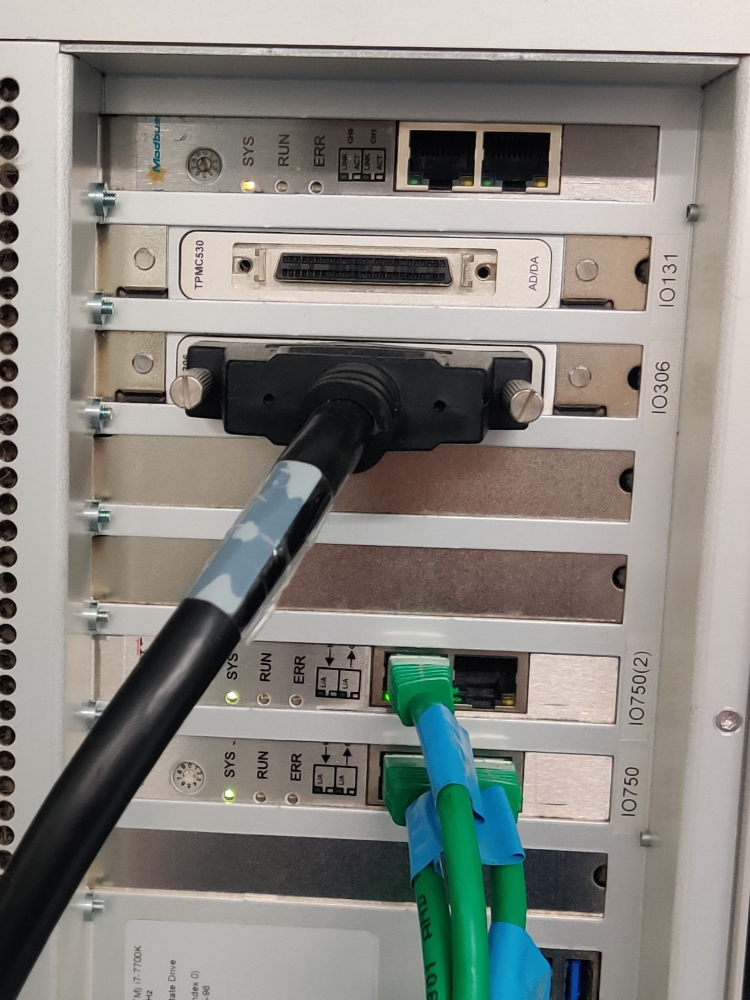

# ATS Hardware Design

| Code          | Editor       |
| ------------- | ------------ |
| 3151_MCS_0050 | Julen Garcia |

## Introduction

This document explains the hardware configuration used for the automatic test system (ATS).

## Hardware configuration

In this section the needed hardware and its configuration is explained.

### Windows Machine

This is a Windows 10 machine where LabVIEW simulators and tools run.

The configuration of the hardware is:

- CPU: Intel i5-7500 @ 3.40GHz
- RAM: 8 GB
- Hard Drive: SSD 250 GB
- OS: Windows 10 Pro version 1909
- x2 Ethernet gigabit connection ports

### Speedgoat

The Speedgoat is a real time target machine used to simulate the main axes behavior.

The configuration of the hardware is:

- CPU: Intel i7-7700K @ 4.20GHz
- RAM: 4 GB
- Hard Drive: SSD 500 GB
- Required Input/Output modules:
  - Ethercat Slave module IO750 (x2)
  - Digital IOs module IO306

### PILZ CPU

This is used to simulate and test the safety software.

The configuration of the hardware is:

- PILZ PSSu 4000 ref 314070
- PSSu E F 4DI-T (not really in use at the moment)
- PSSu E F 4DO 0.5-T

### Linux VMs

There are two Debian 12 VMs for the ATS.

#### ATS Bosch Dockers

For running the secondary axis (bosch axis) simulators in docker containers, no graphical interface installed.

This has the following software installed:

- xe-guest-utilities -> for status reporting to the hypervisor
- git
- docker-ce docker-ce-cli containerd.io docker-buildx-plugin docker-compose-plugin
- vim

VM hardware config:

- x4 cores
- 4 GB RAM
- 80 GB ROM

#### ATS Run Tests

For running the robot framework tests.

This has the following software installed:

- xe-guest-utilities -> for status reporting to the hypervisor
- git
- vim
- Python 3.11.2
- requirements from [here](https://github.com/lsst-ts/ts_tma_test_automatic-test-code/blob/develop/docs/Installation.md)
- KDE Plasma for graphical interface
- Remote desktop for running the tests

VM hardware config:

- x12 cores
- 16 GB RAM
- 80 GB ROM

### Mount Control Computer (MCC)

This is a CentOS 7 machine which replicates the one in the server room at the summit in Chile. It runs the EUI
(Engineering User Interface), the database for the settings and events and the
[mtmount_operation_manager](https://github.com/lsst-ts/ts_tma_operation-manager_mt-mount-operation-manager).

The configuration of the hardware is:

- CPU: Intel i7-3770 @ 3.40 GHz
- RAM: 16 GB
- Hard Drive: HHD 500 GB
- OS: CentOS 7
- x2 Ethernet gigabit connection ports
  - Tekniker local and internet network
  - PXIs subnet

The configuration of the hardware for a ALMA9 OS version is:

- Non-NI hardware: DELL Precision 3660
- CPU: Intel i7-12700
- RAM: 16 GB
- Hard Drive: NVME 250 GB

### TMA PXI

The PXI that contains the state machines for all the main systems and the communication with the MCC and AXES PXI.

The configuration of the hardware is:

- Non-NI hardware: DELL Precision 3660
- CPU: Intel i7-12700
- RAM: 16 GB
- Hard Drive: NVME 250 GB

### AXES PXI

The PXI that contains the code for controlling the main axes, azimuth and elevation.

The configuration of the hardware is:

- Non-NI hardware: DELL Precision 3660
- CPU: Intel i7-12700
- RAM: 16 GB
- Hard Drive: NVME 250 GB

### AUX PXI

The PXI that contains the code for the temperature controllers and the OSS state machines.

The configuration of the hardware is:

- Non-NI hardware: DELL Precision 3660
- CPU: Intel i7-12700
- RAM: 16 GB
- Hard Drive: NVME 250 GB

### EIB 8791

The EIB is the encoder system used to monitor the heads of azimuth and elevation, same as in the summit, more info
[here](https://ts-tma.lsst.io/docs/tma_mcs-equipment-general-description/MCS_Equipment_General_Description.html#encoder-heidenhain-eib-8791)

### cRIO NI 9145

This *cRIO + 8 DIO Module NI 9401* are used to trigger the EIB, same as in the summit, more info
[here](https://ts-tma.lsst.io/docs/tma_mcs-equipment-general-description/MCS_Equipment_General_Description.html#crio-system)

### Ethernet Switches and Connections

The setup in Tekniker uses 2 switches, a managed one and an unmanaged one.

#### Managed Switch

Netgear GS724Tv4 ProSafe 24-port Gigabit Ethernet Smart Switch. Managed switch ports and VLAN configuration:

| Ports   | VLAN |
|---------|------|
| 1 - 6   | 209  |
| 7 - 8   | 213  |
| 9 - 12  | 211  |
| 13 - 14 | 180  |

This is the main switch where the following items are connected:

- MCC (VLAN 209: for HMI data communication)
- TMA PXI (VLAN 209: for HMI data communication)
- TMA PXI (VLAN 213: for communication between the two PXIs)
- TMA PXI (VLAN 211: for communication with the EIB)
- AXES PXI (VLAN 213: for communication between the two PXIs)
- AXES PXI (VLAN 211: for communication with the EIB)
- EIB (VLAN 211: for communication with the EIB)

##### VLAN 209

##### VLAN 213

##### VLAN 211

##### VLAN 180

##### Switch config

#### Unmanaged Switch

D-Link DGS-1024D 24 ports Gigabit Ethernet Switch for local network access, this connects to the local network in Tekniker.

## Electrical connections

The setup for the ATS is very simple compared to the real one, but there are a couple of connections anyway.

### Ethercat line device order

AXES PXI -> cRIO 9145 -> Speedgoat IO750 -> Speedgoat IO750(2)

### Digital signals

Speedgoat IO306 card -> module with the 24V signals from the PILZ

[**More details see images here**](#pilz-and-speedgoat-connections)

## Hardware configuration at Tekniker

### Speedgoat modules

### Pilz And Speedgoat Connections

