# ATS Software Design

| Code          | Editor       |
| ------------- | ------------ |
| 3151_MCS_0052 | Julen Garcia |

## Introduction

This document shows the software structure for the ATS.

## Technical description

The simulation software is divided into different elements according to their nature. In this way all similar elements have
a simulation software that can be configured to meet the specific telescope element represented. For example, all drives
for auxiliary axes are simulated by one software that runs with several instances each with a different configuration.
Each simulation software will is explained in [this section](#simulation-software-modules).

Those simulation software modules need some communication tools to exchange data with the real controller. Those
elements are tools that will be explained [here](#tools).

For axes simulators we found two different solutions:

- For main axis, high speed simulation is needed and then a HIL solution with a specific hardware, Speedgoat, is used.
  This is explained [here](#main-axes-simulator).
- For auxiliary axes, the simulation is based on a software simulation with a less demanding timing, running on a Linux
  (Ubuntu) machine, [see](#secondaryaxissil).

Tests are programmed in robot framework and they run on the Linux machine.

In figure below the general overview of all elements is shown. The simulators are running in a windows machine, except
all axes simulators.

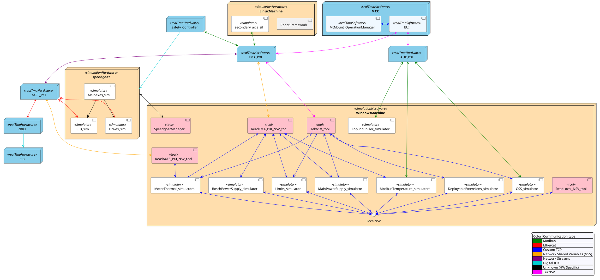

### Simulation software modules

In this section all the simulation software modules are explained. This simulation modules are designed to test a
software component in the real controller. A software component can be tested using the full system with the controllers
for both PXIs or just a small VI with only the required software modules. This test vi is indicated in each simulation
software module.

#### Network Shared Variables Simulator (deprecated, no longer in use)

This module generates random data in the NSV that the EUI reads to make it work even without any code in any of the two
PXIs. Data used only for telemetry is generated by this module when the code is running the PXIs. This is the case of
temperature and pressure of ducts for instance. No software test is related with simulation module.

In the [repository](https://github.com/lsst-ts/ts_tma_hil_network-shared-variables-simulation) for the simulation module
more information can be found.

#### Limit simulator (Limits_simulator)

This module simulates the behavior of the hardware limits that are wired to the IOs module. Since there are not
physical limits the limits are simulated reading the position of the elements. The limit simulator reads data directly
from the TMA-PXI using the TekNSV interface and then uses the tool for reading/writing NSV to the TMA PXI
to write the network shared variables, that are used instead of ethercat variables in simulation mode. The safety
variables that are implemented as TekNSV variables are written with the TekNSV interface.

This module is not valid by itself to test any control module. This is used with other simulators to test the complete
behavior of a subsystem. For instance, locking pins needs the auxiliary axes simulators to simulate the position of the
locking pins and this module with the configuration for locking pins to simulate when the limit switches are pressed or
released.

In the [repository](https://github.com/lsst-ts/ts_tma_hil_simulate-limits) for the simulation module more information
can be found.

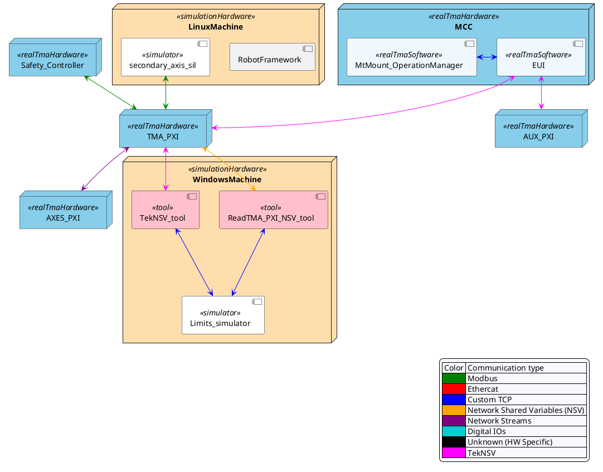

#### Temperature simulator over TCP (MotorThermal_simulators)

This module simulates the thermal behavior of the Phase Drives and the TMA_AZ_CS_CBT_0001 cabinet. This module uses the
ReadWrite three instances.

- The instance to read and write NSVs from the Axes PXI allows to simulate the temperature of the motors
- The instance to read and write NSVs from the TMA PXI allows to simulate the temperature of the TMA_AZ_CS_CBT_0001 cabinet.
- The instance to read and write TekNSVs allows to TODO: check

In the [repository](https://github.com/lsst-ts/ts_tma_hil_motor-thermal-model_motor-thermal-model-simulator) for the
simulation module more information can be found.

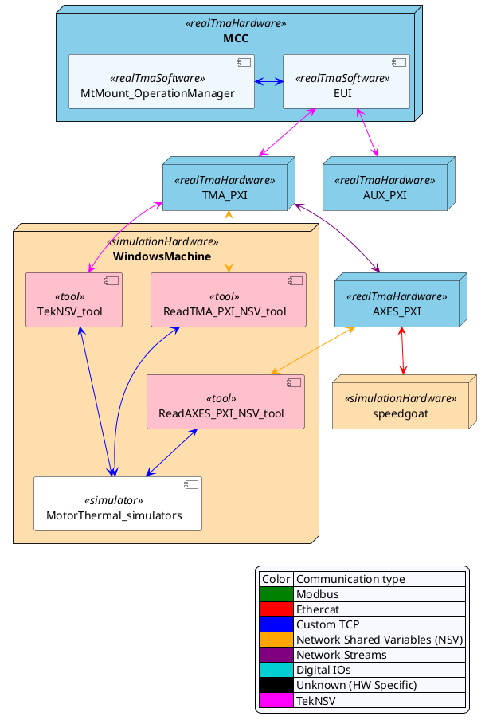

#### Temperature controllers for cabinets (ModbusTemperature_simulators)

This simulator is designed to simulate the temperature behavior in the main cabinet and other cabinets managed by a
temperature controller. This temperature controller is a standalone controller that uses modbus to send/receive data
from the AUX PXI controller.

This module needs the ReadTMA_PXI_NSV_tool module that reads the simulated ethercat variables.

In the [repository](https://github.com/lsst-ts/ts_tma_hil_cabinet-temperature-controller_cabinets) for the simulation
module more information can be found.

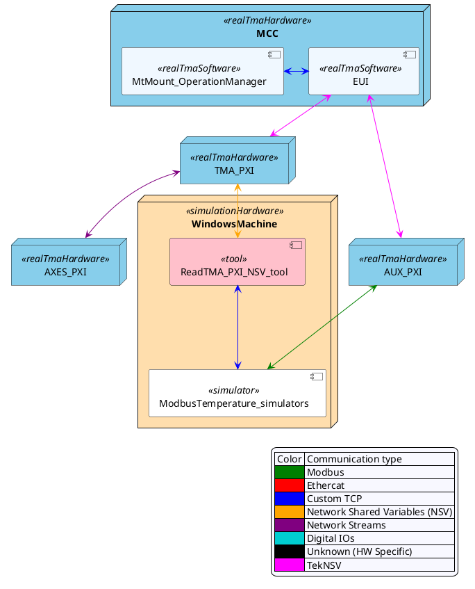

#### SecondaryAxisSil (secondary_axis_sil)

This simulator is designed to simulate the behavior of the auxiliary axes (bosch axes). This simulator is implemented
in docker. There is a docker instance of the same docker image for each axis, each of them with the corresponding
configuration.

In the [repository](https://github.com/lsst-ts/ts_tma_hil_secondary-axis_secondaryaxissil) for the simulation
module more information can be found.

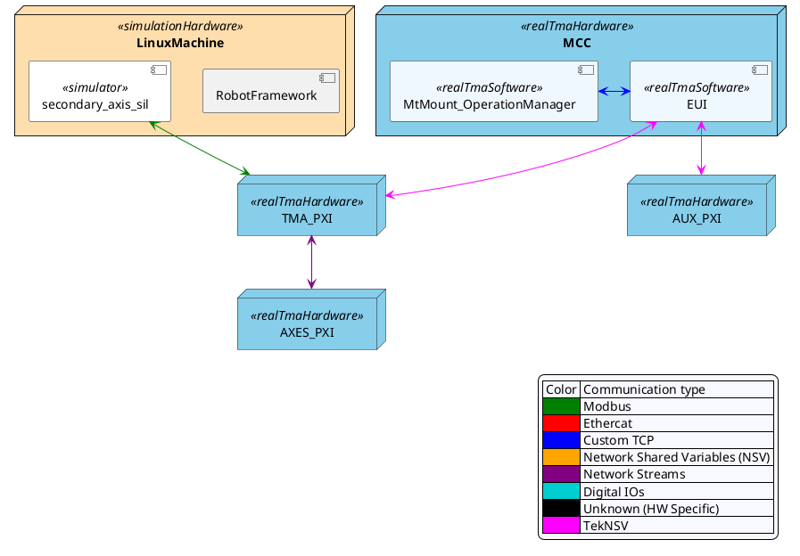

#### Safety simulator (Safety_Controller)

This simulator is designed to simulate the behavior of the TMA IS. The simulator is implemented in PILZ code, as well
as the TMA IS, the difference with the real TMA IS is that the simulator instead of using real IOs wired to the
controller, the value for this IOs comes over Modbus from the TMA PXI. There are only a couple of digital outputs to
send the STO and brakes to the Speedgoat.

This module needs the TekNSV_tool module that read the safety variables hosted in the TMA PXI to simulate inputs for
the Safety simulator, such us limits or ETPBs. This allows the tests to force limits or simulate ETPB being pressed.

In the [repository](https://github.com/lsst-ts/ts_tma_hil_test-dual-modbus) for the simulation
module more information can be found.

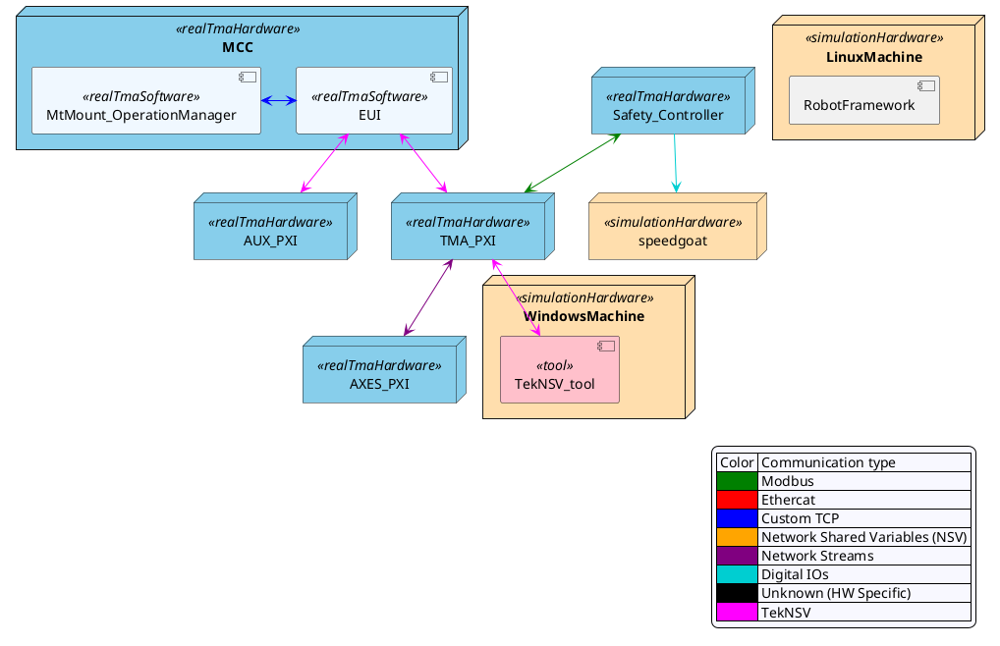

#### OSS simulator (OSS_simulator)

This simulator is designed to simulate the behavior of the Oil Supply system. The simulator is implemented in LabVIEW
code. This simulator, as the real OSS, implements a modbus server to send/receive data from the AUX PXI controller.

This module needs an instance of the TekNSV_tool module to read the safety variables hosted in the TMA PXI to
simulate inputs from the Safety simulator. The local variables at the windows machine are specific of this simulator and
are used to simulate faults.

In the [repository](https://github.com/lsst-ts/ts_tma_hil_oil-supply-system_oil-supply-system-simulator) for the simulation
module more information can be found.

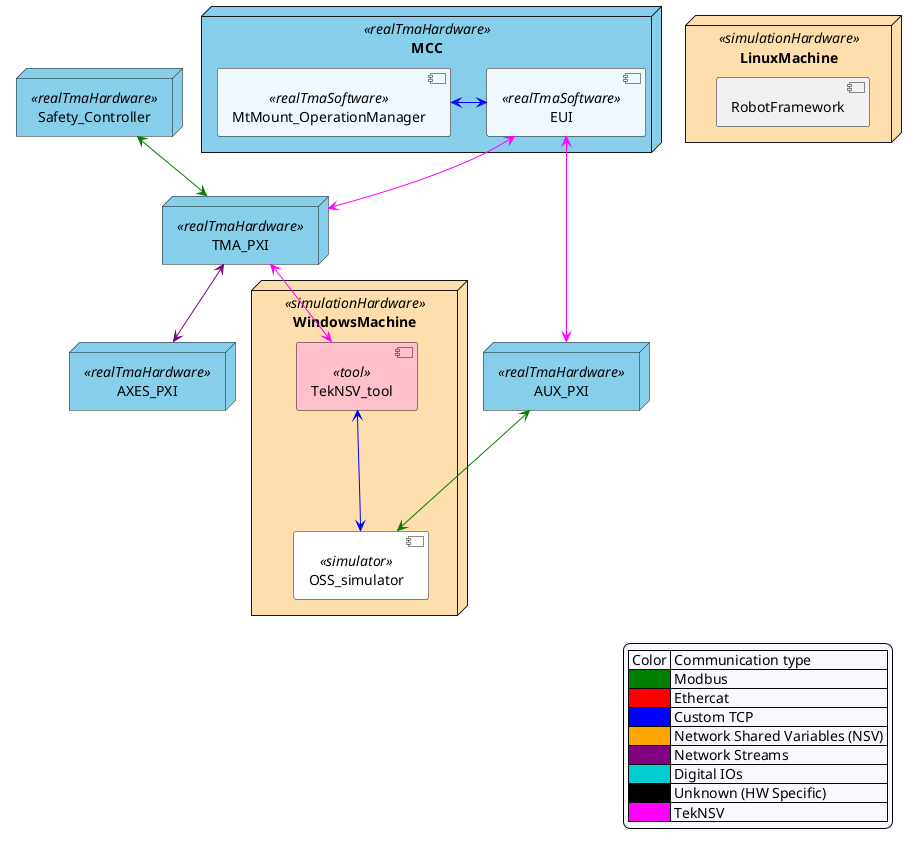

#### Phase Power Supply simulator (MainPowerSupply_simulator)

This simulator is designed to simulate the behavior of the Phase Power Supply. The simulator is implemented in LabVIEW
code. This simulator manages the variables that correspond to the power supply to simulate its behavior.

This module needs an instance of the TekNSV_tool module and the ReadTMA_PXI_NSV_tool module to read the ethercat variables
hosted in the TMA PXI to simulate inputs from the power supply. The local variables at the windows machine are specific
of this simulator and are used to simulate faults.

In the [repository](https://github.com/lsst-ts/ts_tma_hil_phase-power-supply_phase-power-supply-simulator) for the simulation
module more information can be found.

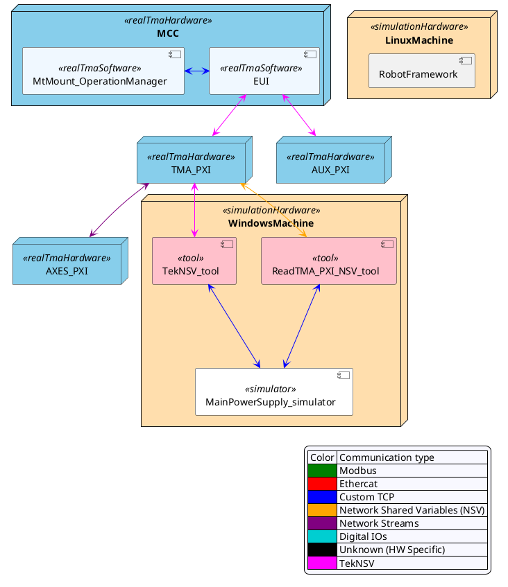

#### Bosch Power Supply simulator (BoschPowerSupply_simulator)

This simulator is designed to simulate the behavior of the Bosch Power Supply. The simulator is implemented in LabVIEW
code. This simulator manages the variables that correspond to the power supply to simulate its behavior.

This module needs an instance of the ReadTMA_PXI_NSV_tool module that read the simulated ethercat variables hosted in the
TMA PXI to simulate inputs from the power supply. The local variables at the windows machine are specific of this
simulator and are used to simulate faults.

In the [repository](https://github.com/lsst-ts/ts_tma_hil_bosch-power-supply_bosch-power-supply-simulator) for the simulation
module more information can be found.

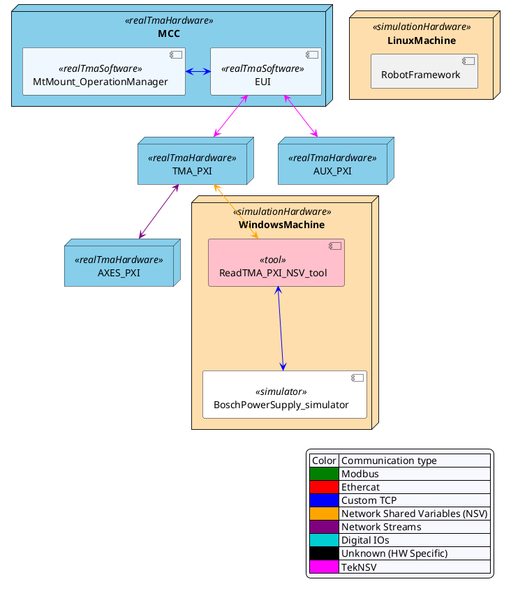

#### Deployable Extensions simulator (DeployableExtensions_simulator)

This simulator is designed to simulate the behavior of the deployable platforms extensions locks. To do so, this
simulator manages the digital inputs that tell the Safety system the status of the extensions of the deployable
platforms locks.

This module needs the TekNSV_tool module that reads/writes the Safety variables hosted in the TMA PXI to simulate
inputs from the hardware that locks/unlocks the deployable extensions.

In the [repository](https://github.com/lsst-ts/ts_tma_hil_deployable-platform-extensions-simulator) for the simulation
module more information can be found.

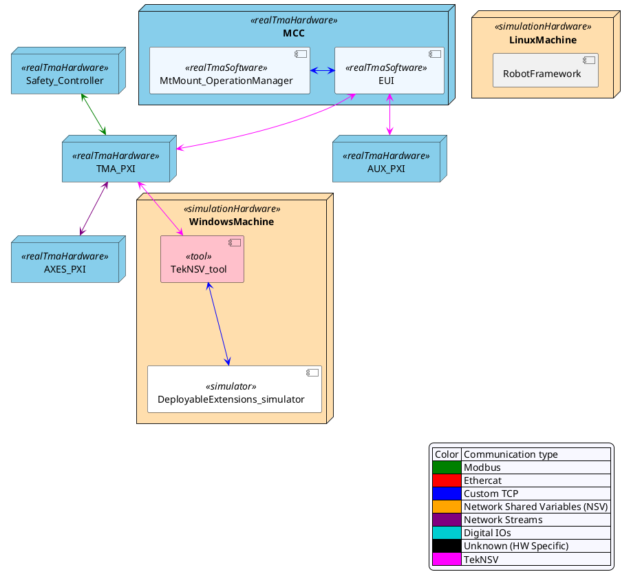

#### Main axes simulator (MainAxes_sim)

This simulator is designed to simulate the mechanical behavior of Azimuth and Elevation. The simulator is implemented in
matlab code and runs in the speedgoat. This simulator uses the Encoder and Drives simulators.

In the [repository](https://github.com/lsst-ts/ts_tma_hil_main-axes_lsst-hil) for the simulation module more information
can be found.

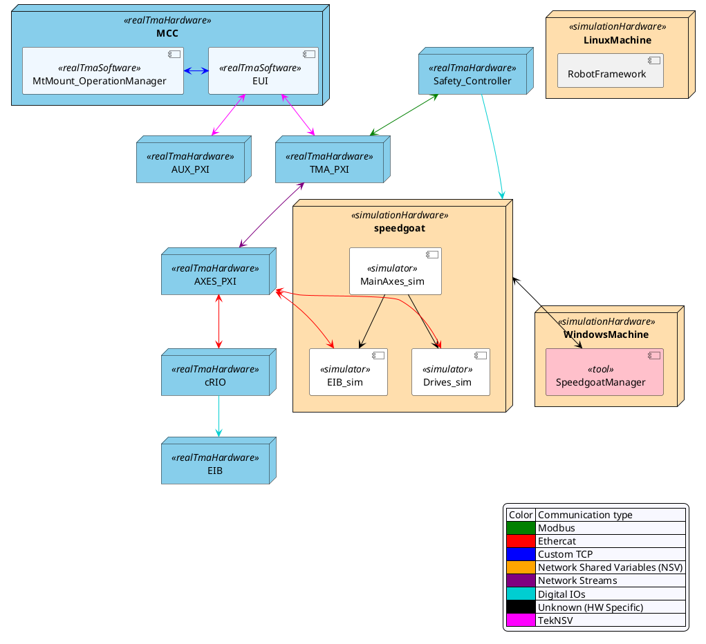

##### Phase Drives simulator (Drives_sim)

This simulator is designed to simulate the behavior of the Phase Drives for Azimuth and Elevation. The simulator is
implemented in matlab code and runs in the speedgoat. This simulator manages the variables that correspond to the drives
to simulate their behavior.

In the [repository](https://github.com/lsst-ts/ts_tma_hil_main-axes_lsst-hil) for the simulation
module more information can be found.

##### Encoder simulator (EIB_sim)

This simulator is designed to simulate the behavior of the Encoder system for Azimuth and Elevation. The simulator is
implemented in matlab code and runs in the speedgoat. This simulator is different from the real EIB, here instead of
publishing the position over UDP it is done over ethercat to tell the axes pxi the actual position of the Azimuth and
Elevation axes, as implementing the simulated communication in ethercat was easier than recreating the UDP communication
from the real EIB.

In the [repository](https://github.com/lsst-ts/ts_tma_hil_main-axes_lsst-hil) for the simulation
module more information can be found.

