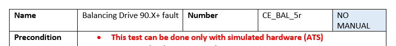
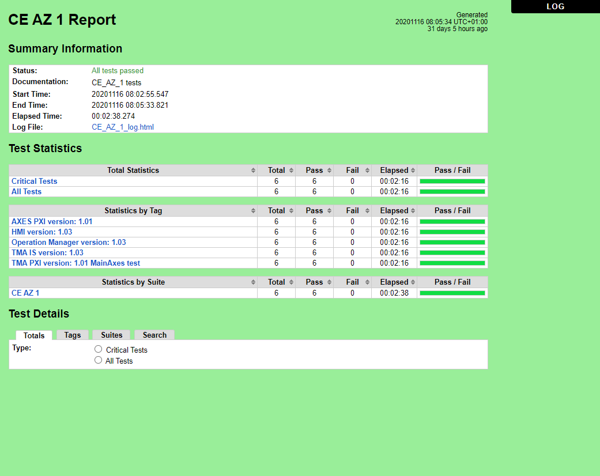
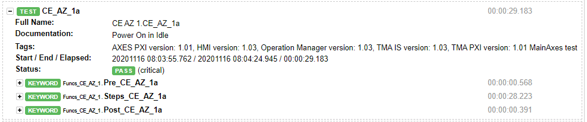
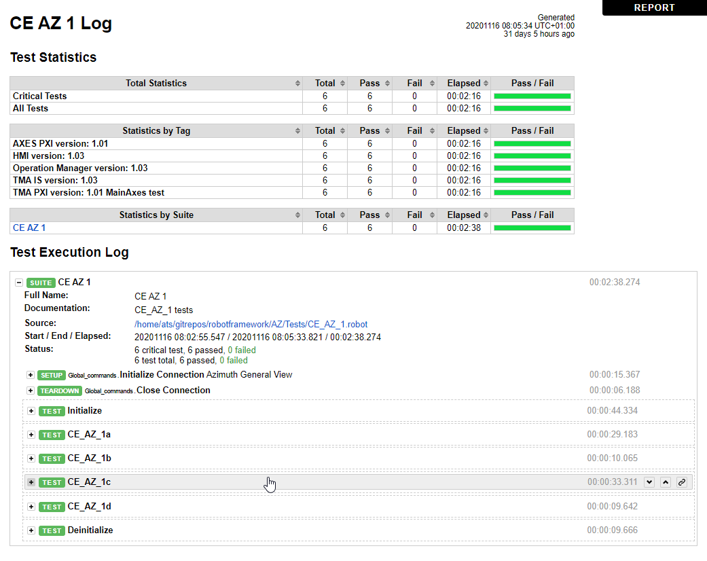

# ATS Testing Plan

> This test plan was created before shipping the TMA to Chile, to test the code without the TMA. Therefore, the tests
> are outdated

This document contains the information related to the testing plan for the TMA.

## Testing Procedures

The tests defined for the TMA can be executed both manually and in automatic mode. The recommend procedure is to use the
automatic mode to test software changes with the simulated hardware before installing it into the real hardware. Once
the real hardware has the software updated execute the tests manually to verify that everything is okay.

The testing procedures are divided by subsystem, having a file for each of the subsystems, these files can be found
[here](https://github.com/lsst-ts/ts_tma_test_testing-procedures).

Each subsystem has many different test cases that are classified by number as follows:

- 0 Reference procedures. Definition of some steps that can be used in other tests.
- 1 Power on/off.
  - Power on in Idle and in On/Enable
  - Power off in On/Enable and in Idle
- 2 Move/MoveVelocity commands.
- 3 Stop command.
- 4 Subsystem specific operations. For example: tracking, retract/deploy mirror cover, etc.
- 5 Event detection. Test every event (alarm/warning) configured for the specific subsystem.
- 6 No event detection. Test that an event in other subsystem does not affect the actual one.
- 7 Alarm processing in Idle state. Test that events are not detected in IDLE state.
- 8 Alarm processing in On static sub-states. Test an event in every static state (recommended: emergency trip push
  button)
  - In DiscreteMove check that STO alarm is received in alarm History window
- 9 Incorrect operation sequences. Check every not permitted actions in every state.
- 10 Reset in Idle.

Inside each test case there are three main sections: preconditions, steps and postconditions.

- Preconditions: check the initial conditions for the test.
- Steps: the steps to perform the test.
- Postconditions: check the exit conditions of the test.

## Manual tests

To execute the tests manually just get the file that corresponds with the subsystem to test and follow the testing
procedure file steps. There are tests that cannot be executed manually, these tests will indicate it explicitly in the
top part of the test definition, see figure bellow.

*Header of a no manual test case.*

## Automatic tests

For the automatic tests the Robot Framework generic open source automation framework is used. The automatic tests
defined in robot framework are based on the testing procedures for each subsystem and follow the same structure.

The source code for the tests can be found [here](https://github.com/lsst-ts/ts_tma_test_automatic-test-code)

The explanation of how the files are organized inside the repo can be found
[here](https://github.com/lsst-ts/ts_tma_test_automatic-test-code/blob/develop/docs/FilesArchitecture.md)

### Results

The robot framework generates some output files in HTML format that contain the results of the tests. To open these
files, download a copy from the gitlab repo and open it with a web browser like chrome.

The two important files for each test case are the ones that end with `.html`, `_log.html` and `_report.html`.
Having one pair of file for each of the test cases available for a specific subsystem.

- The report file (the one the ends with `_report.html`): this file contains a summary of the test, test statistics
  and test details.
  - Summary information: here the main information of the test is located.
  - Test Statistics: here the statistics of the test are located. The version of the code loaded when running the
    test is collected in tag format. Having here the version for the AXES PXI, the HMI, the Operation Manager, the
    TMA IS and the TMA PXI.
  - Test Details: here the details of the test are located.

  
  *Test result example for azimuth test case 1 Report file*

- The log file (the one that ends with `_log.html`): this file contains the test statistics and the test execution log.
  - Test Statistics: same as the report.
  - Test Execution Log: here all the tests inside a test case are listed. All the files will have two stages to set
    the initial conditions and to reset those initial conditions, these are the Initialize and Deinitialize stages.

  Inside each test, the log matches the testing procedures defined for each subsystem, having three separated sections
  for preconditions, steps and post conditions.

  
  *Test result example for azimuth test 1a inside test case 1*

  
  *Test result example for azimuth test case 1 Log file*

The results files generated by robot framework for each subsystem can be found
[here](https://gitlab.tekniker.es/aut/projects/3151-LSST/test/ats_results) organized in folders for each subsystem.
