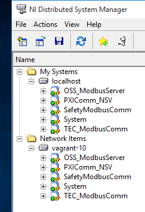
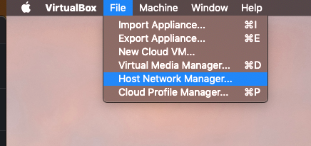
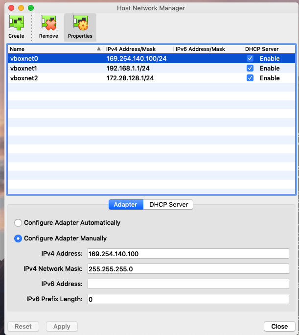
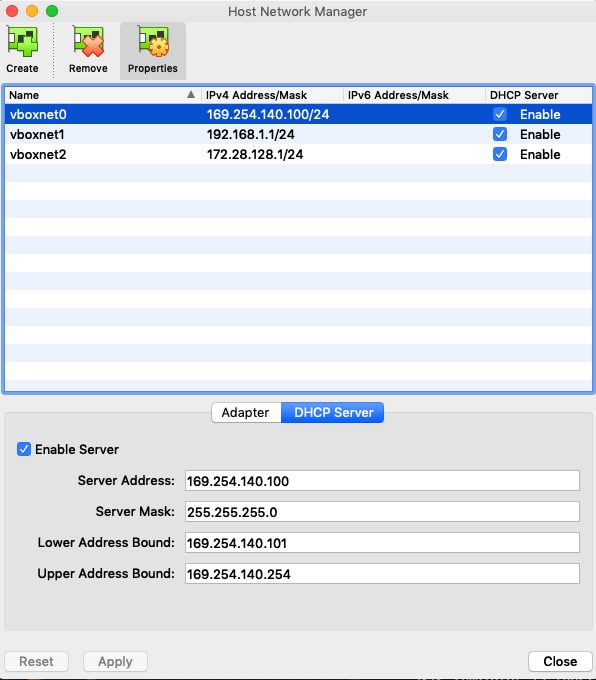
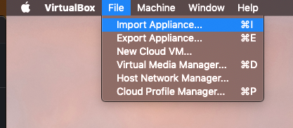
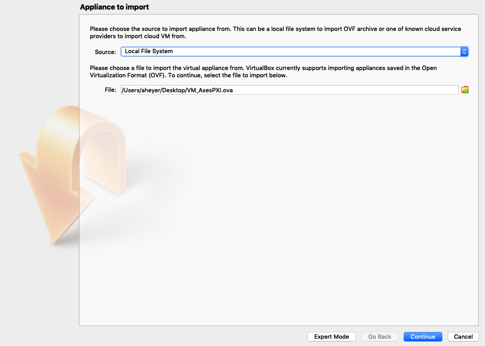
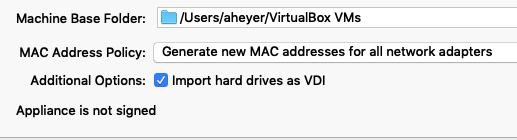
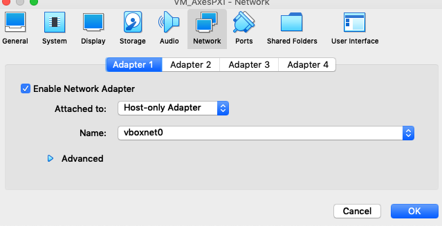
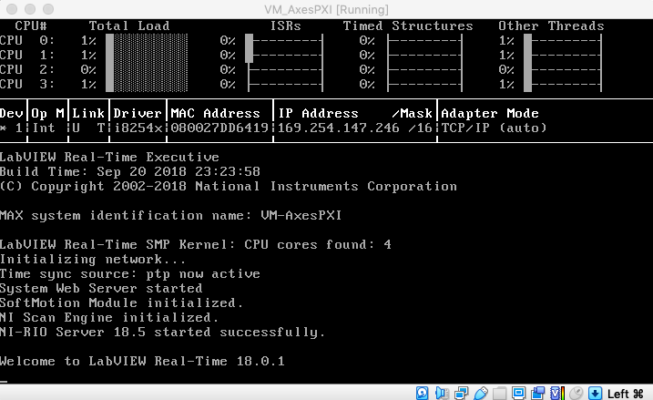

###############################
Simulators and Virtual Machines
###############################

This document describes use of the TMA software simulators.
There are three Virtual machines which are used together to simulate varying degrees of simulations.
The virtual machines are;

- tma_software [Docker running CentOS7]: Contains the HMI and Operation Manager
- mtmount_default_1592915418340_39039.ova [virtualbox running Windows 10]: contains two things: the Engineering User Interface (EUI) and a simple "NSV simulator" that produces random values that the EUI can display. Runs the Windows operating system.
- VM_AxesPXI.ova [virtualbox running LabVIEW Realtime 18.0.1]: contains a simple simulator for the axis controller PXI. Warning: this virtual machine uses a lot of CPU cycles.
- VM_TMA-PXI.ova [virtualbox running LabVIEW Realtime 18.0.1]: contains a simulator for the main PXI (the one that handles commands from the Operation Manager). Warning: this virtual machine also uses a lot of CPU cycles.

These simulators and virtual machines allow quick deployment and interaction with software related to the Telescope Mount Assembly.
This page is organized into a handful of sections.
The first and most unique section, is :ref:`simulation-arrangements` which describes how the different simulators and virtual machines can be used in concert.
This is not to be confused with :ref:`configurations` which discusses the configurations of the TMA software which is incognizant of wether it is running a virtual machine or not.
:ref:`simulation-arrangements` on this page is specifically to explain the steps required to configure simulators or virtual machines.
Whereas :ref:`configurations` can be useful on the actual TMA.
In fact some of the steps in :ref:`configurations` are done already for you in some of the virtual machines here. 

The rest of the sections contain simulators organized into their operating systems.
These sections alone won't be very useful unless you know what you are doing with them.
These sections require to do some initial work regardless of whichever simulator you plan to run, these steps are written in a ``pre-requisite`` section for each OS. 

This page is organized this way because there are more than one way to use the same simulator or virtual machine.
To reduce redundant documentation :ref:`configurations` describes the different ways that the simulators and virtual machines can be used.

.. _simulation-arrangements:

Simulation Arrangements
=======================

In this section you will find the different ways that you can run the simulators and virtual machines and why you would want to.
These are listed in order of complexity. 

NSV & HMI Simulation
--------------------

The NSV and HMI Simulation verifies that the NSVs (Network Shared Variables) are communicating between a Windows 10 virtual machine which is publishing the NSV's and a Docker container which is running the HMI (Human Machine Interface).
This HMI is the actual HMI which is running on the TMA, you can read more about the :ref:`human-machine-interface`.
The Docker container you will be pulling is a CentOS7 machine where all the steps described in :ref:`human-machine-interface` have been completed and then exported for quick use.  

1) Begin by finding out what subnet your host machines IP is in, step 2 relies on you to know this. 
   The host machine is the computer you are using to run the virtual machines.
   If you don't know how find the host machines subnet you can follow the steps in :ref:`finding-your-ip-subnet`.

2) Now that you know what subnet your host machine is in, you must manually assign an IP address to the windows 10 machine you will be creating in this step.
   Recall that in :ref:`finding-your-ip-subnet` we can assign any IP address we like as long as two rules are followed, these rules also assume that you want to machines to be pingable from other machines; First that the IP must be in the same subnet and the second is that it must not be an IP address already occupied.
   Knowing this you are ready to complete the steps in :ref:`nsv-simulator` - your knowledge on subnets is particular needed when assigning an IP address to the windows 10 machine. 

3) Take note of the IP address that you assigned the Windows 10 machine in step 2, we will need it.
   This is because there are few steps when configuring the HMI that assumes the user to know what IP address they need to assign during a configuration step.
   In order for the HMI to work it must be able to find the NSV's.
   The HMI looks for the NSV's based on a few configuration files that you will be setting.
   These configuration files must contain the IP address which you created in Step 2.
   Knowing this background and the IP address you assigned in step 2 you are ready to complete the steps in :ref:`hmi-virtual-machine`.

.. note::
   One last note that I want to make while you go through :ref:`hmi-virtual-machine`, on the steps for setting the IP address on the configuration files it will take you to :ref:`configurations` which may feel round-a-bout. This is because modifying these files are not just for the purpose for this exercise. It is also necessary to modify those files for the real telescope and other variables. To prevent duplication of those steps throughout this documentation it is centralized in one place and cross-linked.  

4) Done!
   In summary, once you have completed step 3 you will be able to log into the HMI and observe chaotic values on the GUI jumping randomly every second.
   These values are the visual representation of the NSV's that are being generated from the Windows 10 NSV simulator and making it to the HMI running on the Docker container. The next step in complexity is to add PXI simulators that a bit more "real".
   If successful with this exercise you should have most of the groundwork ready to attempt :ref:`nsv-hmi-pxi-simulation`

.. _nsv-hmi-pxi-simulation:

NSV, HMI & PXI Simulation
-------------------------
.. todo:: This is what Russell needs to be able to test the CSC, also the Host Only adapter configuration will be updated with this PR

Windows 10
==========
Currently the Windows 10 virtual machine contains a simulator for the NSVs.  

Pre-requisites
--------------
1) Install Oracle VM VirtualBox
2) Install Oracle VM VirtualBox Extension Pack

.. _nsv-simulator:

NSV Simulator
-------------
The NSV Simulator is required to be able to run the EUI.
This is a useful simulator when you wish to verify that the EUI is installed and is able to communicate to the NSV's

1) Connect to the PDM server, instructions for :ref:`pdm_server` here.
2) Download the tma_windows10 virtual machine TSS-Share/TMA/tma_windows10.ova.
3) Import the tma_windows10.ovs. This can be done my double clicking the downloaded tma_windows10.ovs file and it will import automatically.
   If not, you will need to open VirtualBox and manually import it. Accept the default settings when importing.
4) Attempt to start the virtual machine.
   A dialogue will complain that it cannot because there is no physical adapter for it.
   Select "Change Network Settings", select adapter 2 and you will see Virtualbox pre-selected "Bridged Adapter" for you.
   Click OK.
5) Once inside the Windows10 Virtual Machine open the NI Distributed System Manager.
   There should be an icon for the program on the Desktop.
6) If you do not see the image below restart the machine, for a reason I do not know the VM has mal booted preventing NSV's from becoming available.

7) Double click the program ``ATSSimulatorsAndTools/SimulateTelemetry/SimulateTelemetry.exe`` this program is writing random values to the NSV's.
8) Open the NI Distributed System Manager.
   Expand one of the items under ``localhost``.
   You should see these values changing at random.
   We have now demonstrated that the NSV simulator is functioning properly.
   We verify the values are indeed deployed and being changed via the NI Distributed System Manger.

TMA & Axes Simulator
--------------------
The TMA and Axes PXI Simulator is capable of responding to commands sent to it.
This is a quick way of verifying changes made to the commanding component, or in other words the MTMount CSC (or in legacy software, the Operation Manager). 

1) Connect to the PDM server by following the instructions here :ref:`pdm_server`
2) Download the file ``TSS-Share/TMA/VM_AxesPXI.ova``
3) Download the file ``TSS-Share/TMA/VM_TMA-PXI.ova``
4) Open Virtual box and navigate to "Host Network Manager"

5) Create a Host-only adapter using the configuration shown in the two images below, you will need only vboxnet0. 

6) Import the VM_Axes.PXI.ova file.

7) Select "Generate new MAC addresses for all network adapters" and import the virtual machine.

8) Ensure that under Network settings the virtual machine is using the Host Only adapter that we created.

9) The virtual machine should now be able to boot up and obtain an IP address within the range that we specified when configuring the Host only adapter

CentOS 7
========

Pre-requisites
--------------
Docker was chosen to be the virtual host for the CentOS7 Operating System.
Below are various simulators that run on the CentOS7 Operating System.
However, much of the software requires that you interact with a GUI.
As a result instructions the pre-requisites for getting the software running requires that you have an X11 Server configured so that you may open windows from the Docker container.
The other odd-ball pre-requisite is that the Docker container has software which is proprietary.
This then requires the software to be hosted in a private Docker hub, at the time of writing this the Rubin Observatory project is using a Nexus3 hosting platform for private Docker containers.
In order to access this Nexus3 repository you need to gain access by filing a ticket with the IT department.

1) Install Docker
#) Install an X11 Server for your OS, :ref:`configure_x11`
#) Complete the steps for :ref:`nexus_repo`

.. _hmi-virtual-machine:

HMI (Humane Machine Interface)
------------------------------
The HMI is capable of controlling and monitoring the TMA.
It can determine if the EUI itself is in control, if the CSC is in control, or if the Hand Held Device is in control.
It has various displays which report the status of the CCW (Camera Cable Wrap), OSS (Oil Supply Systems) etc;

The HMI comes preinstalled in a Docker container.
If you wish to manually install the HMI you can follow the the :ref:`human-machine-interface` steps.
Otherwise you can follow these steps below which explain where to pull a Docker container with the HMI pre-installed for you.

1) Complete the pre-requisite steps.
#) Pull the Docker container ``docker pull ts-dockerhub.lsst.org/tma_software:develop``
#) Run the Docker container using the proper arguments to run the Windows X server.
   Mine for example is ``docker run -it -e DISPLAY=$IP:0 -v /tmp/.x11-unix:/tmp/.x11-unix -v /Users/aheyer/gitdir/:/home/saluser/gitdir andrewheyer/tma_software:develop``

The command which worked for a linux user is ``sudo docker run -it --net=host --env="DISPLAY" --volume="$HOME/.Xauthority:/root/.Xauthority:rw" -v /home/rfactory/lsst/docker/:/home/saluser/gitdir ts-dockerhub.lsst.org/tma_software:develop``

#) Modify the ``HMITelemetryVariablesURls.ini``.
   The steps for doing these are :ref:`hmi-telemetry-variables`
#) Modify the ``HMIConfig.xml``. The steps for doing these are :ref:`hmi-config`
#) Do ``labview64``
#) When asked to "Select files to recover" deselect all and Discard.
#) Open the ``LSST_HMIs.lvproj`` file. It should already be listed under "All Recent Files"
#) When asked to find "FGV_BasicFGVAction.ctl" open the drop down selection from the top.
   The last item from this drop down menu will have a path ending with "/_controles", open this path. You will see the ``FGV_BasicFGVAction.ctl`` file here. Double click it.
#) Ignore the "Load Warning Summary" Dialogue.
#) The LabVIEW project should now be open, expand "Main" and double click "HMIMain_EUI.VI"
#) A "Resolve Load Conflict" window will appear, double click the middle option.
   This option also is the only one that has a "14.0" string under "LabVIEW Version". Double click this option.
#) Ignore the "Load Warning Summary" Dialogue.
#) Click the run arrow.
#) Login using the :ref:`hmi-login` for credentials.
#) Done!

NI Linux RT
===========
This is how we create a VM that runs NI's Real Time Linux OS.

1. Grab the recovery image from the labview RT Images folder
#. Create a VM using Virtual Box

.. figure:: /_static/images/tma-vm-system-settings.png
   
   The system settings for the VM.

#. Make sure that the EFI option is enabled otherwise the VM will not boot correctly.

.. figure:: /_static/images/tma-vm-network-settings.png

   The network settings for the VM.

#. Set the network adapter to use bridged mode for both ethernet cards.
#. Start the installer
#. Follow the installer instructions, just click ``y``.
#. Reboot the VM

.. figure:: /_static/images/tma-vm.png

   A successful VM start.

To finish the installation, use the NI MAX software to configure the "PXI".
This will setup and install the necessary configurations to setup the device.
Also change the host name to "TMA-PXI" or "AXES-PXI" depending on which one has not yet been created.

After installing the OS, we now install and configure the ethercat library.

1. Clone the `ethercat library <https://gitlab.com/etherlab.org/ethercat>`_.
2. Download and install the automake and autoconf packages using the opkg manager.

.. prompt:: bash

   ./configure
   make
   make modules

Then copy the configuration files to the appropriate locations

.. prompt:: bash

   cd /opt/ethercat
   cp etc/sysconfig/ethercat /etc/sysconfig
   ln -s etc/init.d/ethercat /etc/init.d/

Now edit the configuration file located at :file:`/etc/sysconfig/ethercat` to update the main ethercat card's MAC Address.

.. code:: 

   MASTER0_DEVICE = "ff:ff:ff:ff:ff:ff" # fill out with ethercat supported card

And then fill out the device drivers for the child devices.

.. code:: 

   DEVICE_MODULES="" # fill out with the particular driver 
   # Possible values : 8139 too , e100 , e1000 , e1000e , r8169 , generic , ccat , igb . Choose generic if unknown

Then start the ethercat service.

.. prompt:: bash

   /etc/init.d/ethercat start

Then you can start installing the :ref:`PXI controller software <docs/developer/ats_deployment_guide:tma pxi>`.
