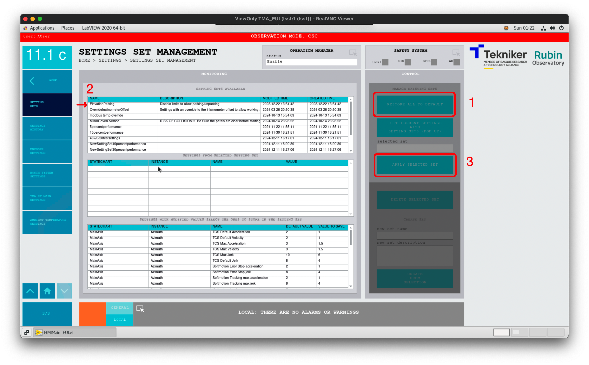

<!-- This new page was created by Jacqueline Seron
-->

# Set TMA performance settings

## Introduction

The TMA EUI allows to change many settings. One of the most important during operations is the mount movement settings: 
speed, acceleration, and jerk. These values are grouped into performance settings files. 
You can find the list of available performance settings in the
[Settings Set Management view](https://ts-tma.lsst.io/docs/tma_eui-manual-english/03_Settings/017_SettingsSetManagement.html). 

> [!IMPORTANT]
> TMA settings are cumulative, if you do **NOT** <code>RESTORE ALL TO DEFAULT</code> you keep previous settings applied.

## Precondition: 

* Azimuth and Elevation drives must be powered off.

## Procedure

1. Go to HOME > Settings > [Settings Set  Management view](https://ts-tma.lsst.io/docs/tma_eui-manual-english/03_Settings/017_SettingsSetManagement.html )  

2. Press <code>RESTORE ALL TO DEFAULT</code>. This will set the TMA EUI default settings for velocity, 
acceleration and jerk for both axes, which normally is 5%.

3. Select the desired settings from the Setting set available section, 
e.g.  *ElevationParking* or *10percentperformance*.

4. Verify the settings have change in the Home > Settings >:

   1. [Elevation Setting](https://ts-tma.lsst.io/docs/tma_eui-manual-english/03_Settings/004_ElevationSettings.html ) 

   2. [Azimuth Settings](https://ts-tma.lsst.io/docs/tma_eui-manual-english/03_Settings/002_AzimuthSettings.html )

*Figure 1: TMA Settings set management window.*

> [!IMPORTANT]
> *ElevationParking* **ONLY disables the elevation limits (set to FALSE)**, it does NOT change velocity, acceleration and jerk limits values.

