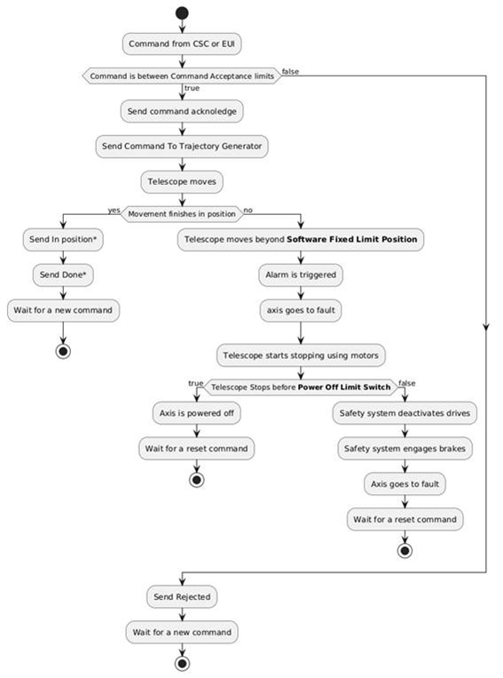
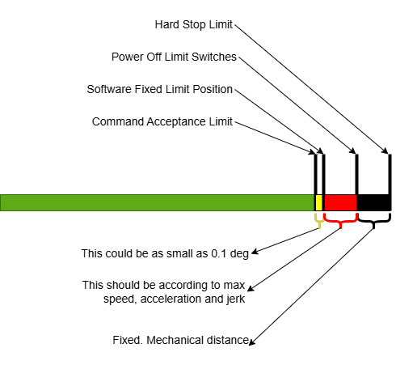
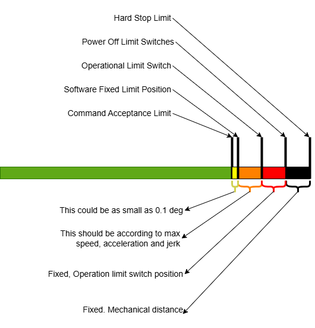

# Main Axes Limits

## Limits operation as per specifications (NOT HOW THEY ACTUALLY WORK)

Notice that the proposed behavior for limits, the one that forces the telescope to stop close to the defined limits, is
quite strange and if applied the overall behavior of the system will not be the desired one.

With the proposed limits design, if the CSC commands a position out of moving boundaries, and the system just tries to
go to that position, but a limit is applied as in the specifications, the steps shown below will happen:

1. The command is sent by the CSC
2. The TMA accepts the command
3. The TMA starts moving
4. The TMA stops moving close to the limit, but far from the requested position in step 1
5. The TMA sends and *inPosition* event. But the TMA is not in the desired position. The *inPosition* event compares the
   *rms* error from the trajectory generator and the actual position for the last values. The CSC commanded position is
   not used to send the *inPosition* event, because the *inPosition* is calculated every 1 ms instead of every 50ms.

## Actual limits implementation

Tekniker thought that the behavior explained in the previous section is not wanted for the TMA. So Tekniker implemented
a more classic limit approach, as an implementation like the one proposed by Rubin could be very difficult to implement.
If the idea is just to force the command value coming from the EUI or CSC to valid ones it is quite easy, but the strange
behavior explained in the previous section will occur. On the other hand, if the CSC needs feedback to know that the
command is accepted but the end position is forced (limited) to a valid one, then the communication between TMA and CSC
must be updated.

At this moment, these are the limits available in the system:

- **Command Acceptance Limit:** this is the limit for accepting or rejecting a command, if the TMA gets a position
  command outside this *Command Acceptance Limit*, it will answer with a *Rejected* response, meaning that the movement
  is not going to be executed. So, the CSC easily knows that there is something wrong with the commanded position. On the
  contrary, if the command is accepted, the telescope will "always" stop inside the limits in a controlled way.
  "Always", meaning if nothing goes wrong, this is, most of the cases. The telescope rarely hits any of the limits
  explained later or finishes in another position that is not the commanded one. The values for the maximum and minimum
  allowable positions are settings, that can be managed by the user. In addition, there are limits for these settings,
  to avoid absurd values. The settings for command acceptance are: `Limits Max Position value` and `Limits Min Position value`.
- **Software Fixed Limit Position:** this is a software limit that will trip if the axis (Az/El) position exceeds the
  defined limit value. When tripped, the limit will cause the axis (Az/El) to stop in fault mode, but using the motors
  with the defined acceleration (deceleration). These limits (positive and negative) can be managed using the settings.
  The settings for software fixed limits are: `Limits Positive Software limit value` and `Limits Negative Software limit value`
- **Limit Switches:** these are electromechanical limit switches, activated when the telescope reaches a fixed position.
  If the telescope presses one of these electromechanical switches, the axis will be stopped in fault mode using the motors.
  The elevation *Operational Limit Switches* work in the same way and have been working reliably. These limits are connected
  to the TMA PXI I/O ethercat modules.
  > The Limit Switches for both axes are physically too close the *Power Off Limit Switches* (about 0.1 deg), this margin
  > is not enough to stop the TMA without overcoming the maximum allowed accelerations, so these limits will work only
  > at very low speeds.
  The settings for enabling/disabling these limits are: `Limits Positive Limit Switch enable`, `Limits Negative Limit Switch enable`,
  `Limits Positive Operational Limit Switch enable` and `Limits Negative Operational Limit Switch enable`
- **Power Off Limit Switches:** these are electromechanical limit switches, activated when the telescope reaches a
  fixed position. These electromechanical switches are managed by the safety system (TMA IS). When a
  *Power Off Limit Switch* is pressed the safety system disables the torque in the drives (safe torque off or STO is
  applied) and applies the brakes. So, the stopping distance and acceleration depends on the brakes capability at that
  moment.
  > When for an error the TMA reaches one of these limits, an override is needed and the TMA must be moved back far enough
  > to clear it
- **Hard Stop Limit:** this is a mechanical hard limit for when everything else fails. It is a mechanical stop
  system with a damping device. The telescope should reach the *Hard Stop Limit* without power in the drives, as the
  *Power Off Switches* will be pressed before reaching here. To reach these limits in normal operation several failures
  must occur in the telescope at the same time: the software is not responding to actual position, the brakes must be
  not working properly, and this must happen close to the limit and at full speed.

So, with these limits available this is the actual behavior of TMA:

  The events with a [\*] in the image above are not always sent. The `inPosition` status is sent after a slew, but with
  tracking commands, the telescope remains *inPosition*. The `Done` response is only sent for point-to-point movements.

The proposed position of the limits for azimuth should be something similar to the ones from the figure bellow. This
figure is also valid for elevation when the parking settings are applied, as the `Operational limit` switches are disabled.

For elevation limits, the operational limit switch is included in the figure:

The distance between `Software Fixed Limit` and the active limit switch can be approached using this formula (it is 10%
more than the movement necessary to stop the axis traveling at maximum programmed speed using the maximum programmed
acceleration with infinite jerk): $ S = 1.1*(\frac{3}{2}*\frac{Vmax^2}{Amax}) $

The telescope's correct movement is monitored by various limits and checks, including those for overspeed, following error,
and extrapolation time (time without new tracking commands).

Furthermore, limits for speed, acceleration, and jerk, similar to the command acceptance limit, prevent any commands with
a value exceeding these defined bounds from being accepted. These can be adjusted from settings, named as follows:
`EUI/HHD/TCS Max Velocity`, `EUI/HHD/TCS Max Acceleration` and `EUI/HHD/TCS Max Jerk`.

> For more details about the settings check the
> [**settings list from the manual here**](https://ts-tma.lsst.io/docs/tma_eui-manual-english/03_Settings/023_SettingsList.html)
