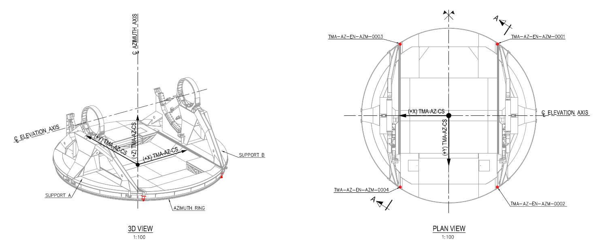
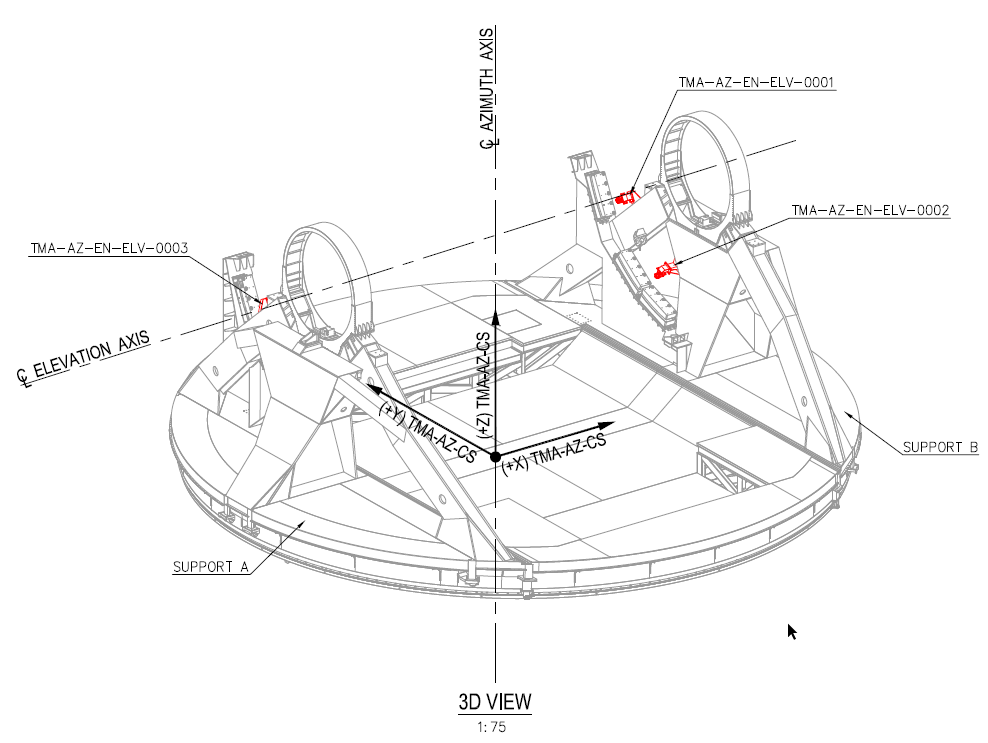
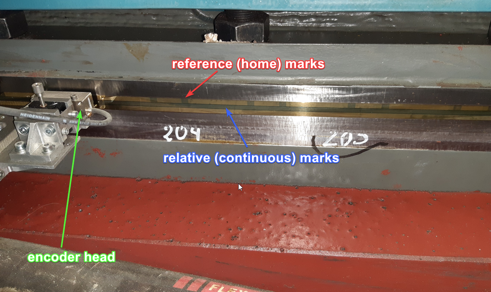

# Encoder System Measurements

## General description of the encoder measuring system

The measuring system for the TMA, for AZ and EL axes, has the following hardware:

- [Heidenhain EIB 8791](./resources/EIB8791_Manual_V03_en.pdf) (in this document the *EIB*): External Interface Box for
  connecting Heidenhain encoder heads
- 8 encoder scanning heads: optical measuring devices from the MSB ERA 8900 series by Heidenhain
  - 4 for Azimuth axis
  - 4 for Elevation axis
- 3 encoder tapes: scaled (40 um grating period) tape for optical measurements from the ERA 8900 series by Heidenhain
  - 1 for Azimuth axis
  - 2 for Elevation axis, one per side

> As seen in the hardware list above, there's just 1 EIB for both axes, this means that the EIB needs to be on even when
> just one axis (Az or El) is on.

### Azimuth heads location

### Elevation heads location

### Encoder + head detail

## How the position is obtained for each encoder head

The measured position value of each head (*relative position*) is reset to 0 each time the encoder is powered on from the
TMA software. In normal operation, this happens every time AZ or EL is powered ON after being both OFF.

The value of the *relative position* is sent by the EIB as a composed number, 48 bits. This number has 32 bits for the
period (counting the number of lines in the tape that the head passes over, NumberOfCountedLines) and 16 bits for the
phase (the space between two lines, DistanceBetweenLines). This is, if the lines passed over by the head are 33 and the
has moved 55% of the distance to the next line, the data sent by EIB can be interpreted as 33.55 lines passed over
by the head. The distance between lines is 40um, so the data sent by the EIB can be multiplied by a constant value that
converts this data into *rad* or *deg*, this constant will be the *headGain* and is obtained using the formula
$headGain (\frac{deg}{lines})=arctg(\frac{40um}{RadiusOfTheTapeLocation}) \approx \frac{40um}{RadiusOfTheTapeLocation}$

The operations done with the data sent by the EIB to obtain angular degrees are:

- Get the in between lines value

  $headSubLineValue (lines) = Double(\frac{DistanceBetweenLines}{2^{16}})$

  > This number is always less than 1.

- Get the total lines, counted lines + the in between lines value

  $headLinesValue (lines) = Double(NumberOfCountedLines) + headSubLineValue$

- Get the head relative position

  $headRelativePosition (deg)= HeadLinesValue * headGain$

All the *headRelativePosition* values have a similar value all the time without any offset, since they start always at 0.
The differences between them are related with Encoder precision, encoder tape runout, deformations in the structure,
temperature changes in different parts of the telescope due to the sun or other heat sources...

## How the position from each head is used for the control loop

The position feedback value used for the axis control loop is the average value of the *headRelativePosition* measured
by the valid[^1] heads + an offset (*axisStartupOffset*), this offset is calculated using the inclinometer for EL and the
Azimuth Cable Wrap (ACW) for AZ during the axis powering on. **The controller never uses other value to control the axis**.

The control position is NOT an absolute position, but this is not meaningful, as the control just needs a continuous value
to perform the control operations properly. This is the reason why the relative position is used and offsets are applied
to it to make it absolute for adapting received commands and to update published telemetry.

The axis relative position (*axisRelativePosition*) can be calculated as shown bellow when the 4 heads of the axis have
a valid value.

$axisRelativePosition = \frac{(headRelativePosition1 + headRelativePosition2 + headRelativePosition3 + headRelativePosition4)} 4 + axisStartupOffset$

> *axisStartupOffset* is the offset calculated to have a rough absolute position for starting the axis, which provides a
> good enough estimation of where the axis is before performing a home. Without this offset the axis will always start at
> 0 deg. This offset is calculated using the inclinometer position for EL or the ACW position for AZ. This offset is
> constant for each power cycle, as it's just calculated during powering on.

If there are only 3 valid encoder heads, the mean value is calculated using only the 3 valid values. If there
are 2 valid values only 2 will be used. If there is only one valid value that value will be used as the mean value.

## Home process

As the reference marks (see [Encoder + head detail](#encoder-head-detail)), home marks, are not continuous in the tape,
the axis needs to make some movements to find some reference marks in the encoder tape and then calculate the absolute
position. So there are some steps in the home process, these are:

1. Move the axis to find reference marks in the encoder tape, then stop the axis.
2. Get the reference value from the EIB hardware. The reference value is the number of lines (there is no sublines info,
   or it is always zero) that must be subtracted to the actual read lines to make the relative position absolute
   $headLineAbsoluteValue (lines) = headLinesValue - referenceValue$. This position is the absolute position of each
   head in the encoder tape. So, those values are different for each head.
3. The value calculated in step 2 is the absolute position of each head in the tape, but in order to be a valid value,
   all the heads must be about the same value. This is done using an offset for each head.
   $headLineAbsoluteReferencedToSamePosition (lines) = headLinesValue - referenceValue + headOffset$. The calculation of
   this offset, *headOffset (lines)*, is explained in
   [this document](https://ts-tma.lsst.io/docs/tma_maintenance_eib_position-measurement-and-references/Position-Measurement-and-References.html).
   With this offset, all the heads return the same absolute position of the axis. These absolute positions are not
   precisely aligned with the axes of the telescope reference system but they will be corrected later, step 6. This
   corrected position has the zero reference as follows, for azimuth 0 is when the azimuth cable wrap is at its centered
   position and for elevation 0 is when elevation is at horizontal plane.
4. The absolute position in deg for each head is obtained multiplying this last value by the *headGain*
   $headAbsoluteReferencedToSamePosition (deg) = headLineAbsoluteReferencedToSamePosition * headGain$
5. As azimuth allows more than 360 deg movement, an additional step is needed to adapt the reference value. The value
   obtained in step 4 for each head is compared with the ACW value, and if the position is 360 deg away from the ACW
   position, the *headOffset* is modified in the number of lines of the tape (360 deg are 1243770 lines) so that the position
   matches the actual ACW position.
6. To make the position of each head match the axes of the telescope reference (AZ having the 0 match the north and EL
   have the 0 match the horizontal plane), there is another offset applied to the head position, this is the *TelescopeOffset (deg)*.
   This offset has a different value for each axis, but the same value for all heads in the same axis.
   $headTelescopeAbsolutePosition (deg)= headAbsoluteReferencedToSamePosition  + telescopeOffset$.
   The mean of these values for the active heads is considered the telescope absolute position.
   $axisEncoderAbsolutePosition (deg) = \frac{(headTelescopeAbsolutePosition1+headTelescopeAbsolutePosition2+headTelescopeAbsolutePosition3+headTelescopeAbsolutePosition4)}4$
7. After the homing procedure for the EIB (the first 6 steps) are OK, the axis waits for a stabilization time. This time
   is to be sure that the telescope is fully stopped and without any oscillations.
8. After the stabilization time, the average of *axisEncoderAbsolutePosition* for the last X ms (this X time can be defined
   with a setting) is sent to the axis controller as absolute position. This generates an offset, *axisHomeOffset (deg)*,
   that is applied to the received commands (*axisAbsolutePositionSetPoint*) and to the telemetry in the axis. The value of
   this offset will be invariant until a new home is done or the axis is powered off, when it becomes zero.
   $axisAbsolutePositionSetPoint (deg) = axisRelativePositionSetPoint(deg) + axisHomeOffset$ and $axisAbsolutePosition (deg) = axisRelativePosition + axisHomeOffset$.
   The commands sent to the telescope are *axisAbsolutePositionSetPoint*, so the controller calculates the *axisRelativePositionSetPoint*.

> In all the homing process only the *axisHomeOffset* is calculated, the offsets for heads are constants calculated in
> the startup or in a maintenance procedure.

## Published telemetry by the PXI to the EUI

The published telemetry by the PXI is listed bellow. Replace <AxisName> with *Azimuth* or *Elevation* and <AxisEncoderName>
with *EL* or *AZ*.

- **<AxisName> Angle Actual** = *axisAbsolutePosition* after the home procedure is completed, otherwise it is *axisRelativePosition*, because *axisHomeOffset* is 0.
- **<AxisName> Absolute Angle Actual** = *axisAbsolutePosition*
- **<AxisName> Softmotion Head #**. These are the values of each head converted with all the offsets used by the axis
  $axisSoftmotionHead = headRelativePosition + axisStartupOffset + axisHomeOffset$
- **<AxisName> Controller Angle Set** = *axisAbsolutePositionSetPoint*
- **Encoder Head Relative <AxisEncoderName> #** = *headRelativePosition*
- **Encoder Head Telescope <AxisEncoderName> #** = *headTelescopeAbsolutePosition*
- **Encoder Head Absolute <AxisEncoderName> #** = *headAbsoluteReferencedToSamePosition*
- **Encoder Head Status <AxisEncoderName> #**. This is the status of the encoder head, in string format.
  If the status is `On\Whatever` the value of the head, *headRelativePosition*, will be used in the calculation of the *axisRelativePosition*.
  If the status is `On\ReferenceValid` the value of the head, *headTelescopeAbsolutePosition*, will be used in the calculation of the *axisAbsolutePosition*.

> \# -> head numbers are 1, 2, 3 and 4 for both Azimuth and Elevation

## Published telemetry to the CSC (EFD) from the EUI

All the telemetry published by the PXI is not passed over to the CSC, the following list covers the telemetry sent by the
EUI to the CSC, related to the variables covered in this document.

> Note that the variables below don't have the AZ or EL references in the names, as they come inside corresponding topics

- Azimuth and Elevation topics:
  - **actualPosition** = <AxisName> Angle Actual
  - **demandPosition** = <AxisName> Controller Angle Set
- Encoder topic:
  - **azimuthEncoderAbsolutePosition1** = Encoder Head Absolute AZ 1
  - **azimuthEncoderAbsolutePosition2** = Encoder Head Absolute AZ 2
  - **azimuthEncoderAbsolutePosition3** = Encoder Head Absolute AZ 3
  - **azimuthEncoderAbsolutePosition4** = Encoder Head Absolute AZ 4
  - **elevationEncoderAbsolutePosition1** = Encoder Head Absolute EL 1
  - **elevationEncoderAbsolutePosition2** = Encoder Head Absolute EL 2
  - **elevationEncoderAbsolutePosition3** = Encoder Head Absolute EL 3
  - **elevationEncoderAbsolutePosition4** = Encoder Head Absolute EL 4
  - **azimuthEncoderRelativePosition1** = Azimuth Softmotion Head 1
  - **azimuthEncoderRelativePosition2** = Azimuth Softmotion Head 2
  - **azimuthEncoderRelativePosition3** = Azimuth Softmotion Head 3
  - **azimuthEncoderRelativePosition4** = Azimuth Softmotion Head 4
  - **elevationEncoderRelativePosition1** = Elevation Softmotion Head 1
  - **elevationEncoderRelativePosition2** = Elevation Softmotion Head 2
  - **elevationEncoderRelativePosition3** = Elevation Softmotion Head 3
  - **elevationEncoderRelativePosition4** = Elevation Softmotion Head 4
  - **azimuthEncoderPosition1** = Encoder Head Telescope AZ 1
  - **azimuthEncoderPosition2** = Encoder Head Telescope AZ 2
  - **azimuthEncoderPosition3** = Encoder Head Telescope AZ 3
  - **azimuthEncoderPosition4** = Encoder Head Telescope AZ 4
  - **elevationEncoderPosition1** = Encoder Head Telescope EL 1
  - **elevationEncoderPosition2** = Encoder Head Telescope EL 2
  - **elevationEncoderPosition3** = Encoder Head Telescope EL 3
  - **elevationEncoderPosition4** = Encoder Head Telescope EL 4

[^1]: An encoder head could give invalid data for various reasons, the most common one has proven to be dirt or oil on
the tape which makes the encoder head fail at some reading and enter an invalid state, as the counts reported by the head are no
longer valid. This can be fixed with a reset of the axis.
