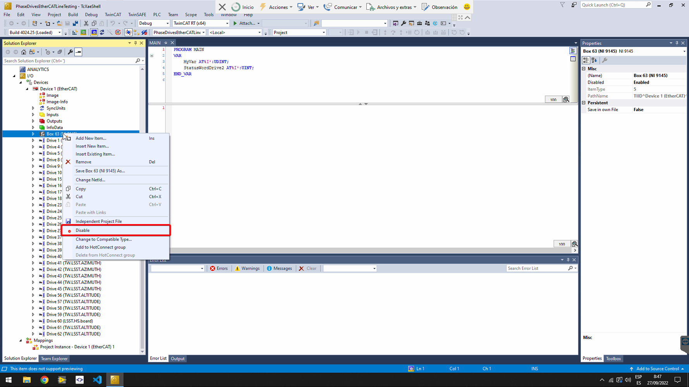
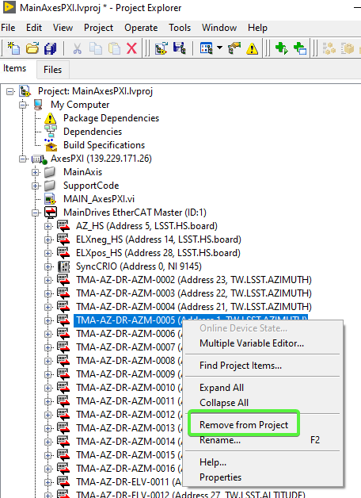
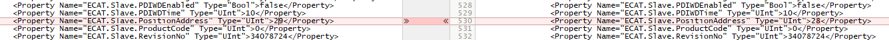
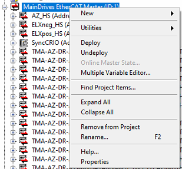

# Bypass EtherCAT Drive for AZ or EL

## Resources

[Check electrical schematics for details on the ethercat connections](https://github.com/lsst-ts/ts_tma_tma-documentation_electrical-schematics/blob/master/MCS_Design_ElectricalSchematics.pdf)

## Definitions

- **Faulty drive**: The drive that has the main issue, comms or power related.
- **Previous drive**: Is the drive that is set before the faulty one, closer to the Master's end.
- **Next drive**: Is the drive that is set after the faulty one, far away from the master's end.
- **M12**: EtherCAT connection implemented on the Drives'end.
- **RJ45**: EtherCAT connection used at the MAster end (PXI or Support Computer)
- **TMA Support Computer**: Is the computer used for any engineering work on TMA and its subsystems. This PC was originally the Black one located nearby the TMA Cabinet (Tekniker ownership) or a new one that will be installed inside the cabinet.

## Drive Bypass Procedure

### 1. Finding the issued drive

Find the faulty drive, this can be done using the
[Ethercat Management Window](https://ts-tma.lsst.io/docs/tma_eui-manual-english/02_Monitor%26Control/048_EthercatManagement.html)
or the by connecting the ethercat line to a Beckhoff master and using the
[diagnostic project (this is available in the TMA Support Computer)](https://github.com/lsst-ts/ts_tma_tma-documentation_maintenance-documents_ethercat_ethercat-line-diagnostic/tree/master/TwinCATProjects/PhaseDrivesEtherCATLineTesting)

### 2. Physical bypass

> Note: for addressing this step a spare M12-M12 or M12-RJ45 spare EtherCAT cable must be used. Spares are available on TMA Spare Cabinets (L5).
> The difference in between cables are:
>
> - M12-M12 cables are for interconnect two consecutive drives.
> - M12-RJ45 cables are for interconnect a PXI to the drives bus line, starting or ending line sections (considering that the redundancy is active)

Connect the proper wire, depending on which is the faulty drive, from the previous drive (to the faulty one) EtherCAT
output to the input port of the following healthy one.

### 3. First quick software verification (TwinCAT - Beckhoff)

Once the drive has been bypassed a quick verification must be done.

a. Access to the TMA Support PC / Tekniker L8 PC remotely or in person.
b. Open the browser for access the EtherCAT switch.
c. Set the EtherCAT line from the PXI to the computer.
d. Open the TwinCAT application with the PhaseDrive project, [details on how to do this are here](https://ts-tma.lsst.io/docs/tma_maintenance_ethercat_ethercat-line-diagnostic/EtherCAT-Line-Diagnostic.html#twicat)
e. Disable the faulty drive on the left tree section (right click on it -> Disable)



f. Set the TwinCAT to Run Mode
g. All slaves should turned into OP (Operational). If not verify previous steps or the bypass it self.
h. Set TwinCAT to Config Mode.
i. Set back the EtherCAT switch to be connected to the PXI.

Getting all the slaves in OP except the faulty one would allow us to move forth to the next step.

### 4. Labview project bypass update

1. Open the Axes project (MainAxesPXI.lvproj) in Labview
2. Remove the faulty drive from the project

   

3. Close save and close the LabVIEW project.
4. Open the project file with vscode, or any other text editor of choice.
5. Update the `ECAT.Slave.PositionAddress` in the text file to match the new drive order after removing the faulty one.
   This means reducing the address of all the drives after the faulty one.

   

6. Save the file and open it again in Labview
7. Deploy the EtherCAT config to the PXI. Right-Click -> Deploy

   

8. Save and exit.

Once the ethercat config is updated in the PXI, the config file for the AXES PXI code has to be updated. For this proceed
as follows:

1. Connect to the AXEs PXI through SSH
2. Edit the `/c/Configuration/MainAxisConfig.ini` file to remove the bypassed drive from it. This is an ini file, so it's
   **very important** to update the index of the arrays after removing an intermediate entry.
3. Save the changes to the file.
4. Reboot the PXI

### 5. Bypass software verification

After the rebooting we shall be able to check the following points:

1. Connect to the AXEs PXI through SSH
2. Check the `labviewmessages` command, confirming that all drives were initialized excepting the faulty one.

   Example for a bypass on AZ 1 drive:

   ```bash
   admin@AxesPXI:~# labviewmessages
   2026-01-29T13:14:38.406+00:00 AxesPXI LabVIEW_Custom_Log: Version: 7.2.0
   2026-01-29T13:14:42.748+00:00 AxesPXI LabVIEW_Custom_Log: Cable Redundancy NOT Enabled
   2026-01-29T13:14:43.042+00:00 AxesPXI LabVIEW_Custom_Log: EtherCAT Slaves found
   2026-01-29T13:14:48.046+00:00 AxesPXI LabVIEW_Custom_Log: Main Started
   2026-01-29T13:14:53.046+00:00 AxesPXI LabVIEW_Custom_Log: Encoder task launched
   2026-01-29T13:14:53.046+00:00 AxesPXI LabVIEW_Custom_Log: Main axes task launched
   2026-01-29T13:14:53.051+00:00 AxesPXI LabVIEW_Custom_Log: Timed Loops Processors: Control Loop Azimuth: 5
   2026-01-29T13:14:53.056+00:00 AxesPXI LabVIEW_Custom_Log: Timed Loops Processors: Control Loop Elevation: 6
   2026-01-29T13:14:53.720+00:00 AxesPXI LabVIEW_Custom_Log: Timed Loops Processors: Trajectory Loop Azimuth: 3
   2026-01-29T13:14:56.818+00:00 AxesPXI LabVIEW_Custom_Log: Drive EtherCAT slave name: MainDrives EtherCAT Master/TMA-AZ-DR-AZM-0002
   2026-01-29T13:14:56.820+00:00 AxesPXI LabVIEW_Custom_Log: Timed Loops Processors: Trajectory Loop Elevation: 4
   2026-01-29T13:14:56.823+00:00 AxesPXI LabVIEW_Custom_Log: Drive EtherCAT slave name: MainDrives EtherCAT Master/TMA-AZ-DR-AZM-0003
   2026-01-29T13:14:56.828+00:00 AxesPXI LabVIEW_Custom_Log: Drive EtherCAT slave name: MainDrives EtherCAT Master/TMA-AZ-DR-AZM-0004
   2026-01-29T13:14:56.833+00:00 AxesPXI LabVIEW_Custom_Log: Drive EtherCAT slave name: MainDrives EtherCAT Master/TMA-AZ-DR-AZM-0005
   2026-01-29T13:14:56.838+00:00 AxesPXI LabVIEW_Custom_Log: Drive EtherCAT slave name: MainDrives EtherCAT Master/TMA-AZ-DR-AZM-0006
   2026-01-29T13:14:56.843+00:00 AxesPXI LabVIEW_Custom_Log: Drive EtherCAT slave name: MainDrives EtherCAT Master/TMA-AZ-DR-AZM-0007
   2026-01-29T13:14:56.848+00:00 AxesPXI LabVIEW_Custom_Log: Drive EtherCAT slave name: MainDrives EtherCAT Master/TMA-AZ-DR-AZM-0008
   2026-01-29T13:14:56.852+00:00 AxesPXI LabVIEW_Custom_Log: Drive EtherCAT slave name: MainDrives EtherCAT Master/TMA-AZ-DR-AZM-0009
   2026-01-29T13:14:56.857+00:00 AxesPXI LabVIEW_Custom_Log: Drive EtherCAT slave name: MainDrives EtherCAT Master/TMA-AZ-DR-AZM-0010
   2026-01-29T13:14:56.862+00:00 AxesPXI LabVIEW_Custom_Log: Drive EtherCAT slave name: MainDrives EtherCAT Master/TMA-AZ-DR-AZM-0011
   2026-01-29T13:14:56.867+00:00 AxesPXI LabVIEW_Custom_Log: Drive EtherCAT slave name: MainDrives EtherCAT Master/TMA-AZ-DR-AZM-0012
   2026-01-29T13:14:56.872+00:00 AxesPXI LabVIEW_Custom_Log: Drive EtherCAT slave name: MainDrives EtherCAT Master/TMA-AZ-DR-AZM-0013
   2026-01-29T13:14:56.877+00:00 AxesPXI LabVIEW_Custom_Log: Drive EtherCAT slave name: MainDrives EtherCAT Master/TMA-AZ-DR-AZM-0014
   2026-01-29T13:14:56.882+00:00 AxesPXI LabVIEW_Custom_Log: Drive EtherCAT slave name: MainDrives EtherCAT Master/TMA-AZ-DR-AZM-0015
   2026-01-29T13:14:56.887+00:00 AxesPXI LabVIEW_Custom_Log: Drive EtherCAT slave name: MainDrives EtherCAT Master/TMA-AZ-DR-AZM-0016
   2026-01-29T13:14:56.892+00:00 AxesPXI LabVIEW_Custom_Log: Hall sensor EtherCAT slave name: MainDrives EtherCAT Master/AZ_HS
   2026-01-29T13:14:56.897+00:00 AxesPXI LabVIEW_Custom_Log: Azimuth Active Damping filter: Type: Lowpass. High Cutoff: 0.000000. Order: 2. Low Cutoff: 35.000000
   2026-01-29T13:14:56.898+00:00 AxesPXI LabVIEW_Custom_Log: Azimuth filter: Type: Lowpass. High Cutoff: 0.000000. Order: 1. Low Cutoff: 25.000000
   2026-01-29T13:15:00.001+00:00 AxesPXI LabVIEW_Custom_Log: Drive EtherCAT slave name: MainDrives EtherCAT Master/TMA-AZ-DR-ELV-0041
   2026-01-29T13:15:00.006+00:00 AxesPXI LabVIEW_Custom_Log: Drive EtherCAT slave name: MainDrives EtherCAT Master/TMA-AZ-DR-ELV-0042
   2026-01-29T13:15:00.011+00:00 AxesPXI LabVIEW_Custom_Log: Drive EtherCAT slave name: MainDrives EtherCAT Master/TMA-AZ-DR-ELV-0061
   2026-01-29T13:15:00.016+00:00 AxesPXI LabVIEW_Custom_Log: Drive EtherCAT slave name: MainDrives EtherCAT Master/TMA-AZ-DR-ELV-0062
   2026-01-29T13:15:00.021+00:00 AxesPXI LabVIEW_Custom_Log: Drive EtherCAT slave name: MainDrives EtherCAT Master/TMA-AZ-DR-ELV-0051
   2026-01-29T13:15:00.026+00:00 AxesPXI LabVIEW_Custom_Log: Drive EtherCAT slave name: MainDrives EtherCAT Master/TMA-AZ-DR-ELV-0052
   2026-01-29T13:15:00.031+00:00 AxesPXI LabVIEW_Custom_Log: Drive EtherCAT slave name: MainDrives EtherCAT Master/TMA-AZ-DR-ELV-0011
   2026-01-29T13:15:00.036+00:00 AxesPXI LabVIEW_Custom_Log: Drive EtherCAT slave name: MainDrives EtherCAT Master/TMA-AZ-DR-ELV-0012
   2026-01-29T13:15:00.041+00:00 AxesPXI LabVIEW_Custom_Log: Drive EtherCAT slave name: MainDrives EtherCAT Master/TMA-AZ-DR-ELV-0031
   2026-01-29T13:15:00.046+00:00 AxesPXI LabVIEW_Custom_Log: Drive EtherCAT slave name: MainDrives EtherCAT Master/TMA-AZ-DR-ELV-0032
   2026-01-29T13:15:00.051+00:00 AxesPXI LabVIEW_Custom_Log: Drive EtherCAT slave name: MainDrives EtherCAT Master/TMA-AZ-DR-ELV-0021
   2026-01-29T13:15:00.057+00:00 AxesPXI LabVIEW_Custom_Log: Drive EtherCAT slave name: MainDrives EtherCAT Master/TMA-AZ-DR-ELV-0022
   2026-01-29T13:15:00.062+00:00 AxesPXI LabVIEW_Custom_Log: Hall sensor EtherCAT slave name: MainDrives EtherCAT Master/ELXneg_HS
   2026-01-29T13:15:00.065+00:00 AxesPXI LabVIEW_Custom_Log: Hall sensor EtherCAT slave name: MainDrives EtherCAT Master/ELXpos_HS
   2026-01-29T13:15:00.070+00:00 AxesPXI LabVIEW_Custom_Log: Elevation filter: Type: Lowpass. High Cutoff: 0.000000. Order: 1. Low Cutoff: 10.000000
   2026-01-29T13:15:01.094+00:00 AxesPXI LabVIEW_Custom_Log: Timed Loops Processors: Encoder UPD Loop: 7
   2026-01-29T13:15:01.722+00:00 AxesPXI LabVIEW_Custom_Log: Timed Loops Processors: Monitoring Loop 1: 2
   admin@AxesPXI:~#
   ```

3. Using the NI Distribution Manager, check the Axes bus line activity seeing values running and changing. (==ScreenShot==)

### 6. Final verification

Power on the AZ and EL axis and perform some movements. This should not cause any issue or alarm.

## Releasing Bypass procedure

If the same original configuration is going to be connected w/o replacing any drive, the reverse steps must be followed.
To make this step easier, git can be used for the `MainAxesPXI.lvproj` and a backup file can be created from
`MainAxisConfig.ini` before changing the file.
