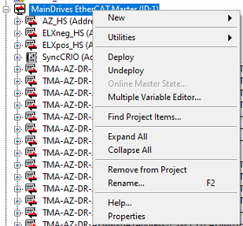

# Replace EtherCAT Drive for AZ or EL

## Resources

[Check electrical schematics for details on the ethercat connections](https://github.com/lsst-ts/ts_tma_tma-documentation_electrical-schematics/blob/master/MCS_Design_ElectricalSchematics.pdf)

## Definitions

- **Faulty drive**: The drive that has the main issue, comms or power related.
- **Previous drive**: Is the drive that is set before the faulty one, closer to the Master's end.
- **Next drive**: Is the drive that is set after the faulty one, far away from the master's end.
- **M12**: EtherCAT connection implemented on the Drives'end.
- **RJ45**: EtherCAT connection used at the MAster end (PXI or Support Computer)
- **TMA Support Computer**: Is the computer used for any engineering work on TMA and its subsystems. This PC was originally the Black one located nearby the TMA Cabinet (Tekniker ownership) or a new one that will be installed inside the cabinet.

## Procedure

### 1. Getting the faulty drive configurations

The current faulty drive configuration file must be downloaded from the faulty drive using the PHASE Support PC. There
will be a PHASE procedure for this soon. If the PHASE procedure has not been delivered yet, contact Marco Rossi, from
Phase for this.

### 2. Replace the faulty drive by the new one physically

> Note that if the faulty drive is bypassed the ethercat wires will not be disconnected/connected in this step.

1. Remove the connections from the faulty one
2. Take out the faulty drive
3. Put in the spare drive
4. Connect all the wires from the faulty one:
   1. CAN Bus
   2. DC Power bus
   3. PT100
   4. Ethercat only if no bypass is in place

### 3. Configuring the spare/new drive

The recovered configuration file from the faulty drive must be uploaded to the new/spare drive. This could be done
following the PHASE procedure, but if the procedure has not been delivered yet, please contact Marco Rossi rom Phase for this.

### 4. Recovering the original bus line (hardware, only if a bypass was in place)

Once the new drive has been set and configured, the next step is to remove the bypass cable.
Once this is done the original line will be connected, with a spare drive in instead the faulty one.

### 5. Software preliminary verification (using TwinCAT)

1. Access to the TMA Support PC / Tekniker L8 PC remotely or in person.
2. Open the browser for access the EtherCAT switch.
3. Set the EtherCAT line from the PXI to the computer.
4. Open the TwinCAT application with the PhaseDrive project, [details on how to do this are here](https://ts-tma.lsst.io/docs/tma_maintenance_ethercat_ethercat-line-diagnostic/EtherCAT-Line-Diagnostic.html#twicat)
5. Enable the faulty drive on the left tree section (right click on it -> Disable)

   

6. Some errors are expected due to the Serial Number mismatching in between the faulty drive and the new one. But
   the drives should all be in OP at this point
7. Set TwinCAT to Config Mode.
8. Set back the EtherCAT switch to be connected to the PXI.

### 6. Labview project updates

Once the new drive is mounted and electrically connected to the rest of the EtherCAT line, the steps listed below must
be followed:

- Open the `MainAxesPXI.lvproj` LabVIEW project, [**located here**](https://github.com/lsst-ts/ts_tma_labview_pxi-controller/).
  It should look something like this, see image below

    

- Delete the replaced drive from the project
  - Copy the name of the replaced drive and note it somewhere, it will be required in a future step
  - Select the replaced drive in teh LabVIEW project and press *supr* key on the keyboard

- Connect to the AXES PXI

  > Make sure that the IP from the project corresponds to the one for the AXES PXI on the TMA.

    

- Add the new drive to the LabVIEW project
  - Right click on the ethercat master, `MainDrives EtherCAT Master`

    

  - Select New > Targets and Devices...

    

  - On the new window, called *Add Targets and Devices*, expand the ethercat master and select the slave that is missing
    in the project and press OK. This will add the device to the project, but with an incorrect name.

    

  - Rename the newly added `Device` to the stored name from the delete slave step

    

  - Check the serial number from the new drive and the data stored in the project
    - Right click on the new drive and select `Online Device State...`

      

    - On the new window, go to Parameters and expand the Identity Object.

      

    - Note the *Revision Number* and *Serial Number*
    - Close the pop up window
    - On the LabVIEW project, right click on the new drive and select *Properties*

      

    - On the new window, check that the contents of the *General* view matches the previously noted *Revision Number* and *Serial Number*

      

      - If they match move on, if not, close the LabVIEW project and edit it in text mode to make the revision/serial number match.
        If by doing this the project marks the new slave as unknown, a new XML must be created with the right revision/serial
        for the new drive. For doing this, take the existing XML, create a new copy and edit the required parameter to match the
        one taken from the slave in the *Identity Object* page.

  - Once the configuration in the project is okay, the new master configuration can be deployed onto the PXI
    - Right click on the `MainDrives EtherCAT Master` and select *Deploy*

      

    - When deploying, it si likely that a conflict resolution pop up will appear. Before clicking apply, make sure the
      conflict solution is set to an option that leaves the scan engine in active as the last step.

      

    - Then a progress pop up will appear and if there is no problem while deploying, the new slave should be properly working
  - Check the ethercat is running, this can be done from the EUI ethercat management window or from the NI Distributed System Manager
    - [Ethercat Management Window](https://ts-tma.lsst.io/docs/tma_eui-manual-english/02_Monitor%26Control/048_EthercatManagement.html)
      - Navigate to the corresponding window in the TMA EUI
      - Check that all the slaves for the AXES PXI are in OP state and that the master is in active state

        

    - NI Distributed System Manager
      - launch the app on a windows computer that has access to the TMA AXES PXI
      - expand the `MainDrives EtherCAT Master`
      - expand a couple of slaves
      - check that the variables are being updated

        

### 7. Final verification

Power on the AZ and EL axis and perform some movements. This should not cause any issue or alarm.

## Troubleshooting

### Ethercat master deployment error -> LabVIEW:  (Hex 0x80DF0002) A file I/O error occurred

[Source](https://forums.ni.com/t5/LabVIEW/cRIO-Unable-to-Undeploy-and-return-system-to-a-good-state/m-p/4367550/highlight/true#M1283227)

This error occurs when for some reason the deployment process gets corrupted.

This can be fixed by removing the `.xml` files from the PXI, this can be done as follows:

- SSH into the AXES PXI
- go to the directory where the XML files are stored -> `cd /var/local/natinst/deployfwk/config/`
- remove the XML files -> `rm *.xml`
- Try deploying the ethercat master from the project again
